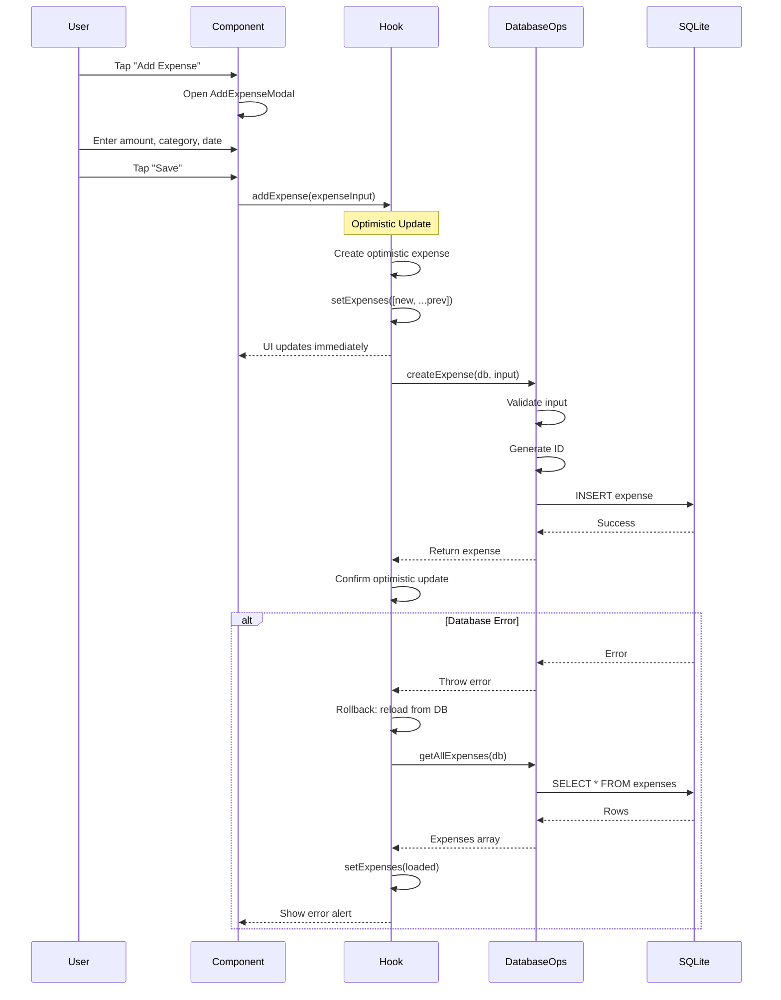
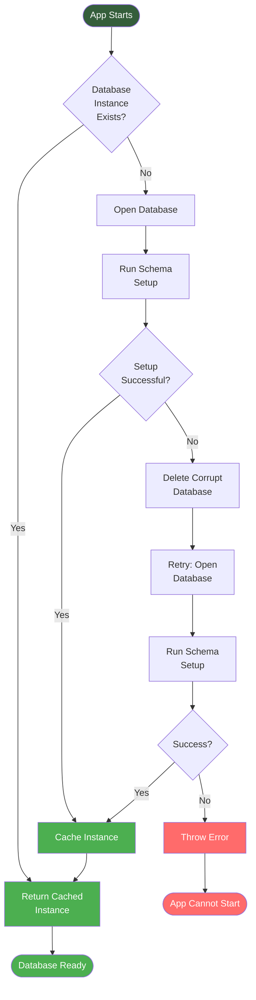
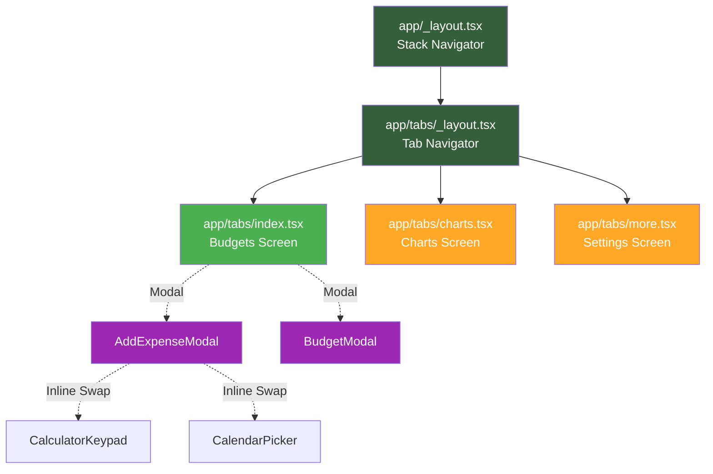

# Architecture Overview

This document provides a comprehensive overview of the BasicBudget application architecture, including system design, data flow patterns, and key architectural decisions.

## Table of Contents

- [System Architecture](#system-architecture)
- [Data Flow Patterns](#data-flow-patterns)
- [Singleton Database Pattern](#singleton-database-pattern)
- [Type System Design](#type-system-design)
- [Navigation Structure](#navigation-structure)
- [State Management](#state-management)
- [Optimistic Updates](#optimistic-updates)
- [Design Decisions](#design-decisions)

---

## System Architecture

BasicBudget follows a **layered architecture** pattern with clear separation of concerns:

```mermaid
graph TD
    subgraph "UI Layer"
        A[Screens<br/>app/(tabs)/]
        B[Components<br/>components/]
    end

    subgraph "State Management Layer"
        C[Custom Hooks<br/>hooks/]
    end

    subgraph "Data Access Layer"
        D[Database Operations<br/>lib/*-db.ts]
        E[Database Singleton<br/>lib/database.ts]
    end

    subgraph "Persistence Layer"
        F[SQLite Database<br/>budget.db]
    end

    subgraph "Type System"
        G[TypeScript Interfaces<br/>types/database.ts]
    end

    A --> B
    B --> C
    C --> D
    D --> E
    E --> F

    G -.Type Safety.-> A
    G -.Type Safety.-> B
    G -.Type Safety.-> C
    G -.Type Safety.-> D

    style A fill:#355e3b,color:#fff
    style B fill:#355e3b,color:#fff
    style C fill:#4CAF50,color:#fff
    style D fill:#FFA726,color:#fff
    style E fill:#FFA726,color:#fff
    style F fill:#757575,color:#fff
    style G fill:#9C27B0,color:#fff
```

### Layer Responsibilities

**UI Layer** (`/app`, `/components`)
- Renders user interface
- Handles user interactions
- Manages local component state
- Calls hooks for data operations
- No direct database access

**State Management Layer** (`/hooks`)
- Provides data and operations to components
- Manages application state (expenses, budgets)
- Handles loading and error states
- Implements optimistic updates
- Abstracts database complexity from UI

**Data Access Layer** (`/lib/*-db.ts`)
- Implements CRUD operations
- Validates data before persistence
- Transforms between database rows and application types
- Handles SQL queries and transactions
- Provides error handling

**Persistence Layer** (SQLite)
- Stores data locally on device
- Provides ACID guarantees
- Indexed for performance
- Survives app restarts

**Type System** (`/types/database.ts`)
- Defines interfaces for all layers
- Ensures type safety across boundaries
- Documents data structures
- Prevents runtime type errors

---

## Data Flow Patterns

Understanding how data flows through the application is crucial for development:



### Key Flow Characteristics

1. **Unidirectional Data Flow**: Data always flows down through props, events flow up through callbacks
2. **Optimistic Updates**: UI updates immediately before database confirmation
3. **Error Rollback**: Failed operations revert UI to previous state
4. **Type Safety**: TypeScript ensures correctness at every boundary
5. **Async Handling**: All database operations are asynchronous

### Example: Adding an Expense

From `/app/(tabs)/index.tsx` (lines 247-262):

```typescript
onSave={async (expense) => {
  try {
    if (editingExpense) {
      // Update existing expense
      await updateExpense(editingExpense.id, expense);
    } else {
      // Add new expense
      await addExpense(expense);
    }
    setModalVisible(false);
    setEditingExpense(null);
  } catch (err) {
    console.error('Failed to save expense:', err);
    Alert.alert('Error', 'Failed to save expense. Please try again.');
  }
}}
```

The hook handles optimistic updates internally (from `/hooks/useExpenses.ts` lines 63-76):

```typescript
async function addExpense(expense: ExpenseInput): Promise<void> {
  if (!db) throw new Error('Database not initialized');

  try {
    // Optimistic update: add to UI immediately
    const newExpense = await createExpense(db, expense);
    setExpenses((prev) => [newExpense, ...prev]);
    setError(null);
  } catch (err) {
    // Rollback on error
    await loadExpenses(db);
    throw err;
  }
}
```

---

## Singleton Database Pattern

BasicBudget uses a **singleton pattern** for database management to ensure a single, shared instance across the entire application.



### Implementation

From `/lib/database.ts` (lines 24-71):

```typescript
let databaseInstance: SQLite.SQLiteDatabase | null = null;

/**
 * Get or create database instance (singleton pattern)
 */
export async function getDatabase(): Promise<SQLite.SQLiteDatabase> {
  if (!databaseInstance) {
    databaseInstance = await initDatabase();
  }
  return databaseInstance;
}

/**
 * Initialize the database and create tables if they don't exist
 */
export async function initDatabase(): Promise<SQLite.SQLiteDatabase> {
  try {
    const db = await SQLite.openDatabaseAsync(DATABASE_NAME);
    await setupDatabase(db);
    return db;
  } catch (error) {
    console.error('Failed to initialize database:', error);

    // Attempt recovery: delete corrupted database and recreate
    try {
      await SQLite.deleteDatabaseAsync(DATABASE_NAME);
      const db = await SQLite.openDatabaseAsync(DATABASE_NAME);
      await setupDatabase(db);
      return db;
    } catch (recoveryError) {
      console.error('Failed to recover database:', recoveryError);
      throw new Error('Unable to initialize database. Please reinstall the app.');
    }
  }
}
```

### Benefits of Singleton Pattern

1. **Single Source of Truth**: All parts of the app use the same database connection
2. **Performance**: Avoids overhead of opening multiple connections
3. **Consistency**: Prevents race conditions from multiple connections
4. **Resource Management**: Properly manages limited mobile resources
5. **Error Recovery**: Centralized recovery mechanism for corruption

---

## Type System Design

BasicBudget uses a **three-tier type system** to maintain clear boundaries between layers:

### Type Hierarchy

```
┌─────────────────────────────────────┐
│   Application Types (UI Layer)     │
│   Expense, Budget, Category         │
│   - Date objects                    │
│   - Camel case properties           │
│   - Domain-specific structure       │
└──────────────┬──────────────────────┘
               │ Transformation
┌──────────────▼──────────────────────┐
│   Database Row Types (Data Layer)  │
│   ExpenseRow, BudgetRow             │
│   - Unix timestamps                 │
│   - Snake case properties           │
│   - Flat structure matching SQL     │
└──────────────┬──────────────────────┘
               │ SQL Queries
┌──────────────▼──────────────────────┐
│        SQLite Tables                │
│   expenses, budgets                 │
│   - INTEGER, TEXT columns           │
│   - Database constraints            │
└─────────────────────────────────────┘

┌─────────────────────────────────────┐
│   Input Types (Validation Layer)   │
│   ExpenseInput, BudgetInput         │
│   - Partial data for create/update │
│   - Validation-ready structure      │
└─────────────────────────────────────┘
```

### Example: Expense Types

From `/types/database.ts`:

```typescript
// Application-level interface (used in UI)
export interface Expense {
  id: string;
  amount: string;
  category: Category;
  date: Date;              // JavaScript Date object
  note: string;
}

// Database row interface (raw data from SQLite)
export interface ExpenseRow {
  id: string;
  amount: string;
  category_id: string;
  category_name: string;
  category_icon: string;
  category_color: string;
  date: number;            // Unix timestamp in milliseconds
  note: string | null;
  created_at: number;
  updated_at: number;
}

// Input type for creating/updating expenses
export interface ExpenseInput {
  amount: string;
  category: Category | null;
  date: Date;
  note: string;
}
```

### Transformation Functions

From `/lib/expenses-db.ts` (lines 20-33):

```typescript
/**
 * Transform database row to Expense object
 */
function rowToExpense(row: ExpenseRow): Expense {
  return {
    id: row.id,
    amount: row.amount,
    category: {
      id: row.category_id,
      name: row.category_name,
      icon: row.category_icon as any,
      color: row.category_color,
    },
    date: new Date(row.date),
    note: row.note || '',
  };
}
```

### Why Three Tiers?

1. **Application Types**: Clean API for UI components, domain-specific structure
2. **Database Row Types**: Match SQL schema exactly, efficient storage
3. **Input Types**: Validation-ready, prevents invalid data from reaching database

This separation ensures:
- **Type Safety**: TypeScript catches mismatches at compile time
- **Clear Boundaries**: Each layer has its own contract
- **Flexibility**: Can change database schema without affecting UI
- **Maintainability**: Transformation logic is explicit and testable

---

## Navigation Structure

BasicBudget uses **Expo Router** for file-based routing:



### Routing Pattern

**File System → Routes**
```
/app/_layout.tsx              → Root layout (Stack)
/app/(tabs)/_layout.tsx       → Tab layout
/app/(tabs)/index.tsx         → / (Home/Budgets)
/app/(tabs)/charts.tsx        → /charts
/app/(tabs)/more.tsx          → /more
```

**Navigation Features:**
- **File-based routing**: Folder structure defines routes
- **Tab navigation**: Bottom tabs for main screens
- **Modal screens**: Overlays for forms (not file-based routes)
- **Deep linking**: Automatic URL support for web

From `/app/(tabs)/_layout.tsx`:

```typescript
<Tabs
  screenOptions={{
    tabBarActiveTintColor: '#355e3b',
    headerShown: false,
  }}
>
  <Tabs.Screen
    name="index"
    options={{
      title: 'Budgets',
      tabBarIcon: ({ color, focused }) => (
        <Ionicons name={focused ? 'wallet' : 'wallet-outline'} size={28} color={color} />
      ),
    }}
  />
  <Tabs.Screen
    name="charts"
    options={{
      title: 'Charts',
      tabBarIcon: ({ color, focused }) => (
        <Ionicons name={focused ? 'bar-chart' : 'bar-chart-outline'} size={28} color={color} />
      ),
    }}
  />
  <Tabs.Screen
    name="more"
    options={{
      title: 'More',
      tabBarIcon: ({ color, focused }) => (
        <Ionicons name={focused ? 'menu' : 'menu-outline'} size={28} color={color} />
      ),
    }}
  />
</Tabs>
```

---

## State Management

BasicBudget uses **local state with custom hooks** rather than a global state management library (Redux, MobX, etc.).

### State Architecture

**Why No Global State Library?**
- **Simplicity**: Fewer dependencies, less boilerplate
- **Performance**: Only relevant components re-render
- **Isolation**: Each feature's state is self-contained
- **React Native Best Practice**: React hooks are sufficient for most mobile apps

### State Organization

```
┌───────────────────────────────────────┐
│  Component Local State                │
│  - UI state (modal visibility)        │
│  - Form state (input values)          │
│  - View state (collapsed sections)    │
└──────────────┬────────────────────────┘
               │ Calls
┌──────────────▼────────────────────────┐
│  Custom Hooks (Feature State)         │
│  - useExpenses (expense data)         │
│  - useBudget (budget data)            │
│  - Loading, error states              │
└──────────────┬────────────────────────┘
               │ Calls
┌──────────────▼────────────────────────┐
│  Database Operations                   │
│  - CRUD functions                      │
│  - No state, pure functions            │
└───────────────────────────────────────┘
```

### Hook Pattern

Hooks encapsulate:
1. **Data** - Current expenses/budgets
2. **Loading State** - Async operation status
3. **Error State** - Error information
4. **Operations** - CRUD functions
5. **Refresh** - Manual reload capability

From `/hooks/useExpenses.ts`:

```typescript
export interface UseExpensesReturn {
  expenses: Expense[];
  loading: boolean;
  error: Error | null;
  addExpense: (expense: ExpenseInput) => Promise<void>;
  updateExpense: (id: string, expense: Partial<ExpenseInput>) => Promise<void>;
  deleteExpense: (id: string) => Promise<void>;
  refreshExpenses: () => Promise<void>;
}
```

### State Lifecycle

1. **Initialization**: Hook mounts → Initialize DB → Load data
2. **Operation**: User action → Optimistic update → DB operation
3. **Success**: Confirm optimistic update → Done
4. **Error**: Rollback optimistic update → Reload from DB → Show error

---

## Optimistic Updates

**Optimistic updates** make the UI feel instant by updating immediately before database confirmation.

### How It Works

1. User performs action (e.g., add expense)
2. **Immediately** update UI with expected result
3. Send database operation in background
4. If success: Keep the optimistic update
5. If error: Rollback to previous state + show error

### Implementation Pattern

From `/hooks/useExpenses.ts` (lines 63-76):

```typescript
async function addExpense(expense: ExpenseInput): Promise<void> {
  if (!db) throw new Error('Database not initialized');

  try {
    // Step 1: Optimistic update - add to UI immediately
    const newExpense = await createExpense(db, expense);
    setExpenses((prev) => [newExpense, ...prev]);
    setError(null);
  } catch (err) {
    // Step 2: Rollback on error - reload true state from DB
    await loadExpenses(db);
    throw err; // Re-throw for component error handling
  }
}
```

### Benefits

- **Perceived Performance**: App feels instantaneous
- **Better UX**: No loading spinners for common operations
- **Network Independence**: Works even with slow database
- **Consistency**: Guaranteed eventual consistency

### Trade-offs

- **Complexity**: More code than simple async operations
- **Potential Confusion**: UI may briefly show incorrect state
- **Error Handling**: Must implement rollback mechanism

---

## Design Decisions

### 1. Why SQLite over Cloud Database?

**Decision**: Use local SQLite database

**Rationale**:
- **Privacy**: User data never leaves device
- **Performance**: No network latency
- **Offline-first**: Works without internet
- **Simplicity**: No backend infrastructure needed
- **Cost**: Free (no server costs)

**Trade-off**: No cross-device sync

---

### 2. Why Custom Hooks over Redux?

**Decision**: Use custom React hooks for state management

**Rationale**:
- **Simplicity**: Less boilerplate, easier to understand
- **Performance**: Only affected components re-render
- **React Native Best Practice**: Hooks are idiomatic in React
- **Type Safety**: Better TypeScript integration
- **Bundle Size**: Fewer dependencies

**Trade-off**: No time-travel debugging or middleware

---

### 3. Why Optimistic Updates?

**Decision**: Implement optimistic updates for all mutations

**Rationale**:
- **User Experience**: Instant feedback feels better
- **Perceived Performance**: App feels faster
- **Mobile Best Practice**: Reduces perception of device lag

**Trade-off**: More complex error handling code

---

### 4. Why Three-Tier Type System?

**Decision**: Separate Application, Database Row, and Input types

**Rationale**:
- **Type Safety**: Catch errors at compile time
- **Clear Boundaries**: Each layer has explicit contract
- **Flexibility**: Can change database without affecting UI
- **Documentation**: Types serve as documentation

**Trade-off**: More type definitions to maintain

---

### 5. Why File-Based Routing?

**Decision**: Use Expo Router's file-based routing

**Rationale**:
- **Convention over Configuration**: Less routing code
- **Deep Linking**: Automatic URL support
- **Type Safety**: Route parameters are typed
- **Modern Standard**: Aligns with Next.js, Remix patterns

**Trade-off**: Less explicit than programmatic routing

---

## Related Documentation

- **[Database Guide](./02-database-guide.mdx)** - Deep dive into SQLite schema and operations
- **[Hooks Guide](./03-hooks-guide.mdx)** - Detailed hook patterns and usage
- **[Component Development](./04-component-development.mdx)** - React component architecture
- **[Getting Started](./05-getting-started.mdx)** - Practical tutorials and examples

---

## Further Reading

- [Expo Router Documentation](https://docs.expo.dev/router/introduction/)
- [React Hooks Documentation](https://react.dev/reference/react)
- [SQLite Documentation](https://www.sqlite.org/docs.html)
- [TypeScript Handbook](https://www.typescriptlang.org/docs/handbook/intro.html)
