# Database Guide

This document provides complete documentation for the SQLite database used in BasicBudget, including schema design, CRUD patterns, query optimization, and error handling strategies.

## Table of Contents

- [Database Schema Overview](#database-schema-overview)
- [Expenses Table](#expenses-table)
- [Budgets Table](#budgets-table)
- [CRUD Operations](#crud-operations)
- [Query Patterns](#query-patterns)
- [Database Initialization](#database-initialization)
- [Type Transformations](#type-transformations)
- [Performance Considerations](#performance-considerations)
- [Error Handling](#error-handling)

---

## Database Schema Overview

BasicBudget uses **SQLite** for local data persistence with two main tables:

```mermaid
erDiagram
    EXPENSES {
        TEXT id PK "UUID primary key"
        TEXT amount "Expense amount as string"
        TEXT category_id "Category identifier"
        TEXT category_name "Category display name"
        TEXT category_icon "Ionicons icon name"
        TEXT category_color "Hex color code"
        INTEGER date "Unix timestamp (milliseconds)"
        TEXT note "Optional note (nullable)"
        INTEGER created_at "Creation timestamp"
        INTEGER updated_at "Last update timestamp"
    }

    BUDGETS {
        TEXT id PK "UUID primary key"
        TEXT month UK "YYYY-MM format, unique"
        TEXT budget_amount "Budget amount as string"
        INTEGER created_at "Creation timestamp"
        INTEGER updated_at "Last update timestamp"
    }

    EXPENSES ||--o{ BUDGETS : "month relationship"
```



### Schema SQL

From `/lib/database.ts` (lines 6-32):

```sql
CREATE TABLE IF NOT EXISTS expenses (
  id TEXT PRIMARY KEY NOT NULL,
  amount TEXT NOT NULL,
  category_id TEXT NOT NULL,
  category_name TEXT NOT NULL,
  category_icon TEXT NOT NULL,
  category_color TEXT NOT NULL,
  date INTEGER NOT NULL,
  note TEXT,
  created_at INTEGER NOT NULL,
  updated_at INTEGER NOT NULL
);

CREATE INDEX IF NOT EXISTS idx_expenses_date ON expenses(date);
CREATE INDEX IF NOT EXISTS idx_expenses_category ON expenses(category_id);

CREATE TABLE IF NOT EXISTS budgets (
  id TEXT PRIMARY KEY NOT NULL,
  month TEXT NOT NULL UNIQUE,
  budget_amount TEXT NOT NULL,
  created_at INTEGER NOT NULL,
  updated_at INTEGER NOT NULL
);

CREATE INDEX IF NOT EXISTS idx_budgets_month ON budgets(month);
```

### Design Decisions

**Why TEXT for Amounts?**
- Preserves exact decimal precision
- Avoids floating-point rounding errors
- Matches JavaScript number handling
- Safe for currency calculations

**Why Denormalized Categories?**
- Categories are predefined constants, not user-generated
- Faster queries (no JOIN required)
- Simpler schema (no categories table needed)
- Acceptable data duplication (12 categories total)

**Why Unix Timestamps?**
- SQLite native format for dates
- Easy to query and compare
- Converts cleanly to JavaScript Date objects
- Sortable as integers

---

## Expenses Table

### Schema Details

| Column | Type | Constraints | Description |
|--------|------|-------------|-------------|
| `id` | TEXT | PRIMARY KEY, NOT NULL | UUID generated by expo-crypto |
| `amount` | TEXT | NOT NULL | Expense amount (e.g., "45.50") |
| `category_id` | TEXT | NOT NULL | Category identifier (e.g., "food") |
| `category_name` | TEXT | NOT NULL | Display name (e.g., "Food & Dining") |
| `category_icon` | TEXT | NOT NULL | Ionicons name (e.g., "restaurant") |
| `category_color` | TEXT | NOT NULL | Hex color (e.g., "#FF6B6B") |
| `date` | INTEGER | NOT NULL | Unix timestamp in milliseconds |
| `note` | TEXT | NULL | Optional user note |
| `created_at` | INTEGER | NOT NULL | Creation timestamp |
| `updated_at` | INTEGER | NOT NULL | Last modification timestamp |

### Indexes

```sql
CREATE INDEX idx_expenses_date ON expenses(date);
CREATE INDEX idx_expenses_category ON expenses(category_id);
```

**Purpose:**
- `idx_expenses_date`: Fast sorting by date (most common query)
- `idx_expenses_category`: Fast filtering by category (for category breakdown)

### Example Rows

```json
{
  "id": "550e8400-e29b-41d4-a716-446655440000",
  "amount": "45.50",
  "category_id": "food",
  "category_name": "Food & Dining",
  "category_icon": "restaurant",
  "category_color": "#FF6B6B",
  "date": 1733356800000,
  "note": "Lunch with team",
  "created_at": 1733356800000,
  "updated_at": 1733356800000
}
```

---

## Budgets Table

### Schema Details

| Column | Type | Constraints | Description |
|--------|------|-------------|-------------|
| `id` | TEXT | PRIMARY KEY, NOT NULL | UUID generated by expo-crypto |
| `month` | TEXT | NOT NULL, UNIQUE | Month in "YYYY-MM" format |
| `budget_amount` | TEXT | NOT NULL | Budget amount (e.g., "2000.00") |
| `created_at` | INTEGER | NOT NULL | Creation timestamp |
| `updated_at` | INTEGER | NOT NULL | Last modification timestamp |

### Unique Constraint

```sql
month TEXT NOT NULL UNIQUE
```

**Purpose:** Ensures only one budget per month. Attempting to insert duplicate month fails, enabling UPSERT pattern.

### Index

```sql
CREATE INDEX idx_budgets_month ON budgets(month);
```

**Purpose:** Fast lookups by month (primary access pattern)

### Example Rows

```json
{
  "id": "660e9500-f39c-52e5-b827-557766551111",
  "month": "2025-12",
  "budget_amount": "2000.00",
  "created_at": 1733356800000,
  "updated_at": 1733356800000
}
```

### Month Format

Budgets use **"YYYY-MM"** format:
- `"2025-12"` → December 2025
- `"2026-01"` → January 2026

**Benefits:**
- Sortable as strings
- Human-readable
- Easy to parse
- Standard ISO 8601 prefix

---

## CRUD Operations

All database operations follow a consistent pattern with validation, error handling, and type transformation.


### Create Operation

**Pattern:** Validate → Generate ID → Insert → Return

From `/lib/expenses-db.ts` (lines 38-89):

```typescript
export async function createExpense(
  db: SQLite.SQLiteDatabase,
  expense: ExpenseInput
): Promise<Expense> {
  try {
    // Validation
    if (!expense.category) {
      throw new Error('Category is required');
    }

    const amountNum = parseFloat(expense.amount);
    if (isNaN(amountNum) || amountNum <= 0) {
      throw new Error('Amount must be a positive number');
    }

    // Generate ID and timestamps
    const id = generateId();
    const timestamp = Date.now();
    const dateTimestamp = expense.date.getTime();

    // Insert into database
    await db.runAsync(
      `INSERT INTO expenses (
        id, amount, category_id, category_name, category_icon, category_color,
        date, note, created_at, updated_at
      ) VALUES (?, ?, ?, ?, ?, ?, ?, ?, ?, ?)`,
      [
        id,
        expense.amount,
        expense.category.id,
        expense.category.name,
        expense.category.icon,
        expense.category.color,
        dateTimestamp,
        expense.note || null,
        timestamp,
        timestamp,
      ]
    );

    return {
      id,
      amount: expense.amount,
      category: expense.category,
      date: expense.date,
      note: expense.note,
    };
  } catch (error) {
    console.error('Failed to create expense:', error);
    throw new Error('Failed to save expense. Please try again.');
  }
}
```

### Read Operations

**Pattern:** Query → Transform → Return Array

**Get All (Sorted by Date):**

```typescript
export async function getAllExpenses(
  db: SQLite.SQLiteDatabase
): Promise<Expense[]> {
  try {
    const rows = await db.getAllAsync<ExpenseRow>(
      'SELECT * FROM expenses ORDER BY date DESC'
    );

    return rows.map(rowToExpense);
  } catch (error) {
    console.error('Failed to get expenses:', error);
    throw new Error('Failed to load expenses. Please try again.');
  }
}
```

**Get by ID:**

```typescript
export async function getExpenseById(
  db: SQLite.SQLiteDatabase,
  id: string
): Promise<Expense | null> {
  try {
    const row = await db.getFirstAsync<ExpenseRow>(
      'SELECT * FROM expenses WHERE id = ?',
      [id]
    );

    return row ? rowToExpense(row) : null;
  } catch (error) {
    console.error('Failed to get expense:', error);
    return null;
  }
}
```

### Update Operation

**Pattern:** Get Existing → Merge Updates → Validate → Update → Return

From `/lib/expenses-db.ts` (lines 132-195):

```typescript
export async function updateExpense(
  db: SQLite.SQLiteDatabase,
  id: string,
  expense: Partial<ExpenseInput>
): Promise<Expense> {
  try {
    // Get existing expense
    const existing = await getExpenseById(db, id);
    if (!existing) {
      throw new Error('Expense not found');
    }

    // Merge updates with existing data
    const updated = {
      amount: expense.amount !== undefined ? expense.amount : existing.amount,
      category: expense.category !== undefined ? expense.category : existing.category,
      date: expense.date !== undefined ? expense.date : existing.date,
      note: expense.note !== undefined ? expense.note : existing.note,
    };

    // Validation
    if (!updated.category) {
      throw new Error('Category is required');
    }

    const amountNum = parseFloat(updated.amount);
    if (isNaN(amountNum) || amountNum <= 0) {
      throw new Error('Amount must be a positive number');
    }

    // Update in database
    const timestamp = Date.now();
    const dateTimestamp = updated.date.getTime();

    await db.runAsync(
      `UPDATE expenses SET
        amount = ?, category_id = ?, category_name = ?, category_icon = ?,
        category_color = ?, date = ?, note = ?, updated_at = ?
      WHERE id = ?`,
      [
        updated.amount,
        updated.category.id,
        updated.category.name,
        updated.category.icon,
        updated.category.color,
        dateTimestamp,
        updated.note || null,
        timestamp,
        id,
      ]
    );

    return {
      id,
      amount: updated.amount,
      category: updated.category,
      date: updated.date,
      note: updated.note,
    };
  } catch (error) {
    console.error('Failed to update expense:', error);
    throw new Error('Failed to update expense. Please try again.');
  }
}
```

### Delete Operation

**Pattern:** Delete by ID

```typescript
export async function deleteExpense(
  db: SQLite.SQLiteDatabase,
  id: string
): Promise<void> {
  try {
    await db.runAsync('DELETE FROM expenses WHERE id = ?', [id]);
  } catch (error) {
    console.error('Failed to delete expense:', error);
    throw new Error('Failed to delete expense. Please try again.');
  }
}
```

### Upsert Pattern (Budgets)

Budgets use an **UPSERT pattern** because of the UNIQUE constraint on `month`:

From `/lib/budgets-db.ts` (lines 53-118):

```typescript
export async function setBudgetForMonth(
  db: SQLite.SQLiteDatabase,
  budgetInput: BudgetInput
): Promise<Budget> {
  try {
    // Validation
    const amountNum = parseFloat(budgetInput.budgetAmount);
    if (isNaN(amountNum) || amountNum <= 0) {
      throw new Error('Budget amount must be a positive number');
    }

    // Validate month format (YYYY-MM)
    const monthRegex = /^\d{4}-\d{2}$/;
    if (!monthRegex.test(budgetInput.month)) {
      throw new Error('Invalid month format. Expected YYYY-MM');
    }

    // Check if budget exists for this month
    const existing = await getBudgetForMonth(db, budgetInput.month);
    const timestamp = Date.now();

    if (existing) {
      // Update existing budget
      await db.runAsync(
        `UPDATE budgets SET budget_amount = ?, updated_at = ? WHERE month = ?`,
        [budgetInput.budgetAmount, timestamp, budgetInput.month]
      );

      return {
        id: existing.id,
        month: budgetInput.month,
        budgetAmount: budgetInput.budgetAmount,
        createdAt: existing.createdAt,
        updatedAt: new Date(timestamp),
      };
    } else {
      // Create new budget
      const id = generateId();

      await db.runAsync(
        `INSERT INTO budgets (id, month, budget_amount, created_at, updated_at)
         VALUES (?, ?, ?, ?, ?)`,
        [id, budgetInput.month, budgetInput.budgetAmount, timestamp, timestamp]
      );

      return {
        id,
        month: budgetInput.month,
        budgetAmount: budgetInput.budgetAmount,
        createdAt: new Date(timestamp),
        updatedAt: new Date(timestamp),
      };
    }
  } catch (error) {
    console.error('Failed to set budget for month:', error);
    throw new Error('Failed to save budget. Please try again.');
  }
}
```

---

## Query Patterns

### Common Queries

**Get Expenses for Specific Month:**

```typescript
const startOfMonth = new Date(2025, 11, 1).getTime(); // Dec 1, 2025
const endOfMonth = new Date(2025, 12, 0, 23, 59, 59).getTime(); // Dec 31, 2025

const rows = await db.getAllAsync<ExpenseRow>(
  'SELECT * FROM expenses WHERE date >= ? AND date <= ? ORDER BY date DESC',
  [startOfMonth, endOfMonth]
);
```

**Get Expenses by Category:**

```typescript
const rows = await db.getAllAsync<ExpenseRow>(
  'SELECT * FROM expenses WHERE category_id = ? ORDER BY date DESC',
  ['food']
);
```

**Calculate Total for Month:**

```typescript
const result = await db.getFirstAsync<{ total: number }>(
  'SELECT SUM(CAST(amount AS REAL)) as total FROM expenses WHERE date >= ? AND date <= ?',
  [startOfMonth, endOfMonth]
);

const total = result?.total || 0;
```

**Get Budget for Current Month:**

```typescript
const currentMonth = '2025-12'; // YYYY-MM format

const row = await db.getFirstAsync<BudgetRow>(
  'SELECT * FROM budgets WHERE month = ?',
  [currentMonth]
);
```

---

## Database Initialization

The database initialization process includes automatic recovery from corruption:


### Implementation

From `/lib/database.ts` (lines 29-61):

```typescript
export async function initDatabase(): Promise<SQLite.SQLiteDatabase> {
  try {
    const db = await SQLite.openDatabaseAsync(DATABASE_NAME);
    await setupDatabase(db);
    return db;
  } catch (error) {
    console.error('Failed to initialize database:', error);

    // Attempt recovery: delete corrupted database and recreate
    try {
      await SQLite.deleteDatabaseAsync(DATABASE_NAME);
      const db = await SQLite.openDatabaseAsync(DATABASE_NAME);
      await setupDatabase(db);
      return db;
    } catch (recoveryError) {
      console.error('Failed to recover database:', recoveryError);
      throw new Error('Unable to initialize database. Please reinstall the app.');
    }
  }
}

async function setupDatabase(db: SQLite.SQLiteDatabase): Promise<void> {
  try {
    await db.execAsync(SCHEMA);
    console.log('Database schema created successfully');
  } catch (error) {
    console.error('Failed to create database schema:', error);
    throw error;
  }
}
```

### Recovery Strategy

**Primary Attempt:**
1. Open database
2. Execute schema SQL
3. Return if successful

**Recovery Attempt (on failure):**
1. Delete database file
2. Create fresh database
3. Execute schema SQL
4. Return if successful

**Fatal Error:**
- If recovery fails, throw error
- User must reinstall app
- Rare (indicates device/OS issue)

---

## Type Transformations

Database rows must be transformed to application types:


### Row to Application Type

From `/lib/expenses-db.ts` (lines 20-33):

```typescript
function rowToExpense(row: ExpenseRow): Expense {
  return {
    id: row.id,
    amount: row.amount,
    category: {
      id: row.category_id,
      name: row.category_name,
      icon: row.category_icon as any,
      color: row.category_color,
    },
    date: new Date(row.date), // Unix timestamp → Date object
    note: row.note || '',      // null → empty string
  };
}
```

### Application Type to Row

No explicit function needed; done inline during INSERT/UPDATE:

```typescript
await db.runAsync(
  `INSERT INTO expenses (...) VALUES (?, ?, ?, ?, ?, ?, ?, ?, ?, ?)`,
  [
    id,
    expense.amount,
    expense.category.id,       // Flatten category
    expense.category.name,
    expense.category.icon,
    expense.category.color,
    expense.date.getTime(),    // Date → Unix timestamp
    expense.note || null,      // Empty string → null
    timestamp,
    timestamp,
  ]
);
```

---

## Performance Considerations

### Indexes

**Current Indexes:**
```sql
CREATE INDEX idx_expenses_date ON expenses(date);
CREATE INDEX idx_expenses_category ON expenses(category_id);
CREATE INDEX idx_budgets_month ON budgets(month);
```

**Query Optimization:**
- Sort by date: Uses `idx_expenses_date` (no table scan)
- Filter by category: Uses `idx_expenses_category` (fast lookup)
- Get budget for month: Uses `idx_budgets_month` (unique lookup)

### Query Patterns to Avoid

**Bad: Get all then filter in JavaScript**
```typescript
// ❌ Inefficient
const allExpenses = await getAllExpenses(db);
const foodExpenses = allExpenses.filter(e => e.category.id === 'food');
```

**Good: Filter in SQL**
```typescript
// ✅ Efficient
const rows = await db.getAllAsync<ExpenseRow>(
  'SELECT * FROM expenses WHERE category_id = ?',
  ['food']
);
```

### Batch Operations

For multiple inserts, use transactions:

```typescript
// ❌ Slow: Individual inserts
for (const expense of expenses) {
  await createExpense(db, expense);
}

// ✅ Fast: Transaction
await db.withTransactionAsync(async () => {
  for (const expense of expenses) {
    await db.runAsync(INSERT_SQL, [...values]);
  }
});
```

### Data Size Considerations

**Current Scale:**
- Typical user: 100-1000 expenses per year
- Database size: <1 MB
- Query performance: <10ms for all operations

**At Scale (10,000+ expenses):**
- Consider pagination for list views
- Add date range queries
- Keep indexes updated

---

## Error Handling

### Database Errors

**Types of Errors:**
1. **Validation Errors** - Invalid input data
2. **Constraint Errors** - Unique/foreign key violations
3. **Connection Errors** - Database not initialized
4. **Corruption Errors** - Database file damaged

### Error Handling Strategy

**Validation Errors:**
```typescript
if (isNaN(amountNum) || amountNum <= 0) {
  throw new Error('Amount must be a positive number');
}
```

**Database Errors:**
```typescript
try {
  await db.runAsync(SQL, params);
} catch (error) {
  console.error('Database operation failed:', error);
  throw new Error('Failed to save data. Please try again.');
}
```

**Connection Errors:**
```typescript
if (!db) {
  throw new Error('Database not initialized');
}
```

**Corruption Recovery:**
```typescript
try {
  const db = await SQLite.openDatabaseAsync(DATABASE_NAME);
  await setupDatabase(db);
  return db;
} catch (error) {
  // Delete and recreate
  await SQLite.deleteDatabaseAsync(DATABASE_NAME);
  const db = await SQLite.openDatabaseAsync(DATABASE_NAME);
  await setupDatabase(db);
  return db;
}
```

### User-Facing Error Messages

**Guidelines:**
- **Be specific**: "Failed to save expense" not "Database error"
- **Be actionable**: "Please try again" not "Error occurred"
- **Log details**: Console log full error for debugging
- **Don't expose internals**: Hide SQL/stack traces from user

---

## Related Documentation

- **[Architecture Overview](./01-architecture-overview.mdx)** - How database fits in system architecture
- **[Hooks Guide](./03-hooks-guide.mdx)** - How hooks interact with database layer
- **[Getting Started](./05-getting-started.mdx)** - Tutorial: Add a database field

---

## Further Reading

- [SQLite Documentation](https://www.sqlite.org/docs.html)
- [expo-sqlite Documentation](https://docs.expo.dev/versions/latest/sdk/sqlite/)
- [SQL Performance Tuning](https://www.sqlite.org/optoverview.html)
