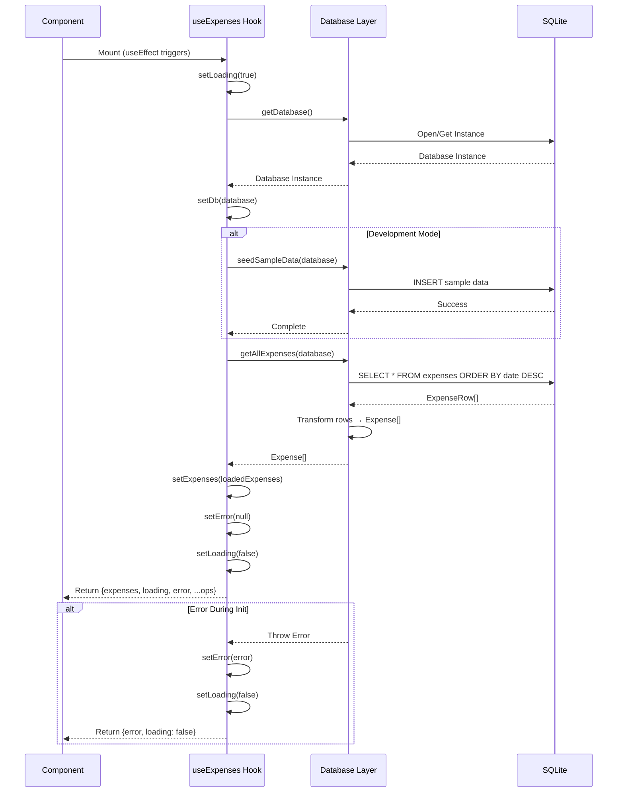
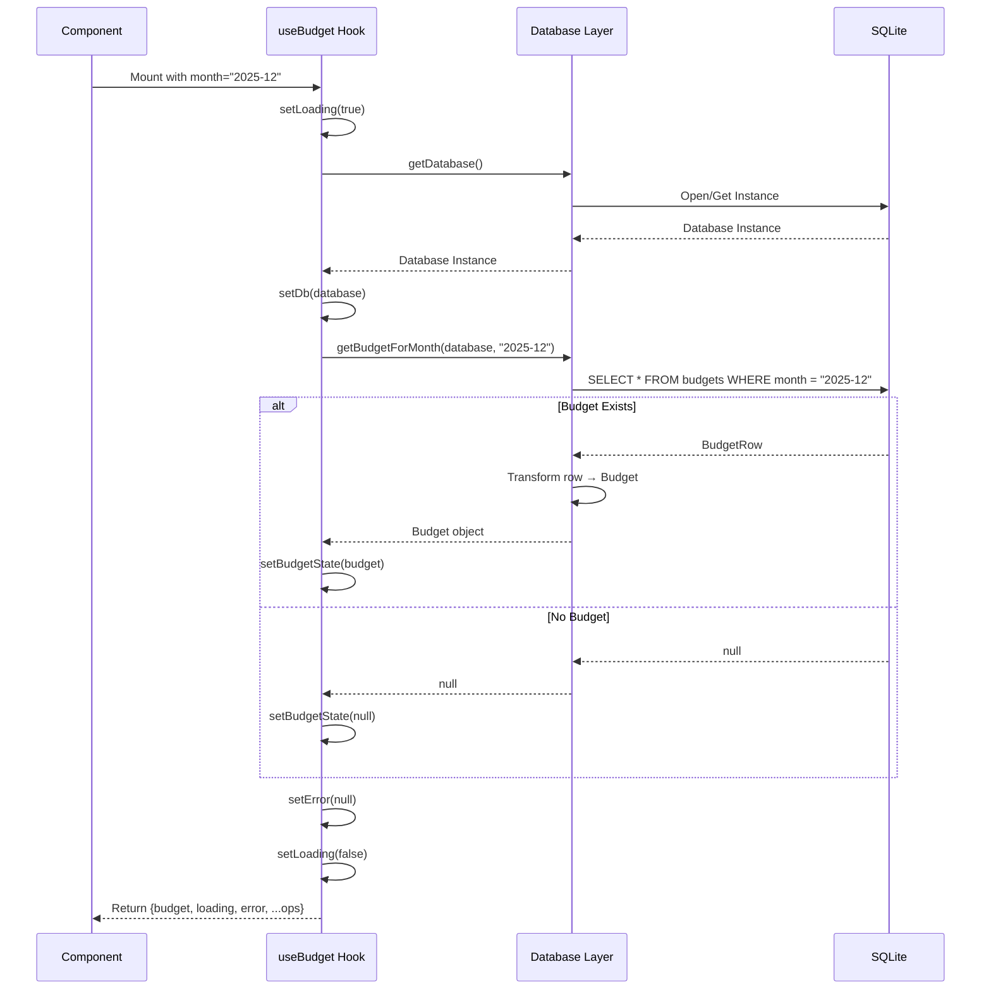
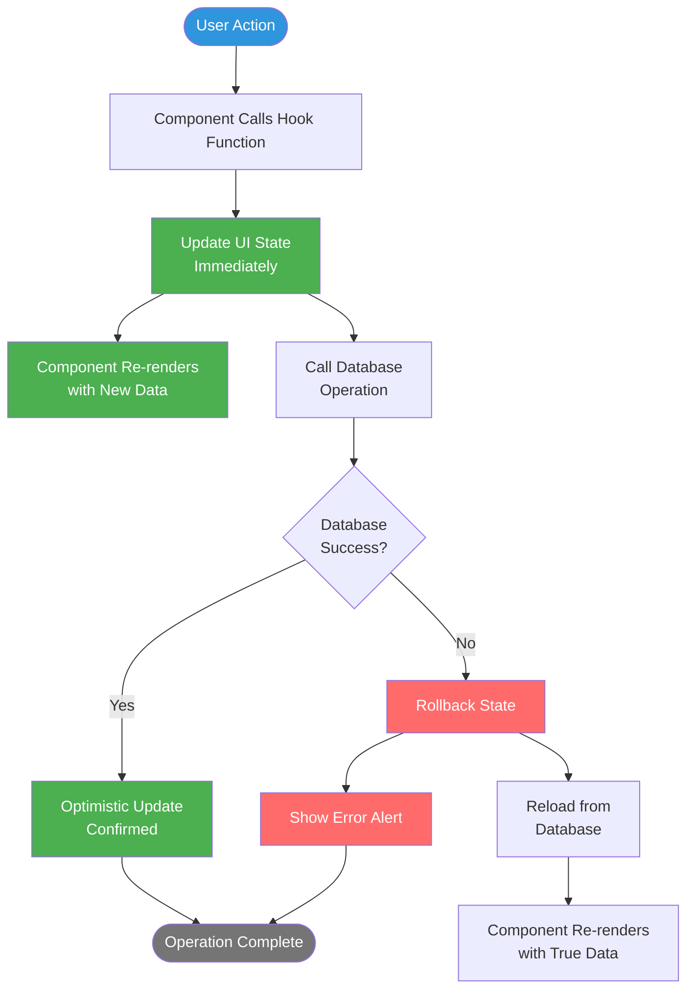
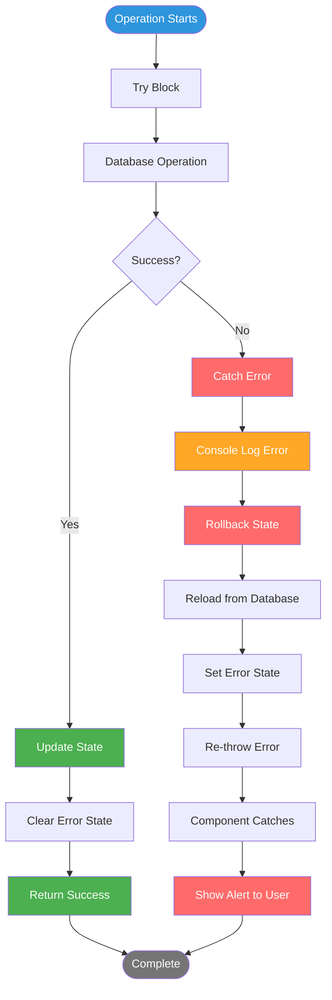

# Hooks Guide

This document provides comprehensive documentation for custom React hooks used in BasicBudget, including state management patterns, optimistic updates, and error handling strategies.

## Table of Contents

- [Hook Architecture](#hook-architecture)
- [useExpenses Hook](#useexpenses-hook)
- [useBudget Hook](#usebudget-hook)
- [Hook Patterns](#hook-patterns)
- [Optimistic Updates](#optimistic-updates)
- [Error Handling](#error-handling)
- [Loading States](#loading-states)
- [Hook Composition](#hook-composition)

---

## Hook Architecture

BasicBudget uses **custom React hooks** as the primary state management layer, providing a clean abstraction between UI components and the database layer.

```mermaid
graph TB
    subgraph "UI Layer"
        Screen[Screen Component<br/>app/(tabs)/index.tsx]
        Modal[Modal Component<br/>AddExpenseModal]
    end

    subgraph "Hook Layer"
        HookExp[useExpenses Hook<br/>State + Operations]
        HookBud[useBudget Hook<br/>State + Operations]
    end

    subgraph "Data Layer"
        DBExp[expenses-db.ts<br/>CRUD Functions]
        DBBud[budgets-db.ts<br/>CRUD Functions]
    end

    subgraph "Persistence"
        DB[(SQLite Database)]
    end

    Screen --> HookExp
    Screen --> HookBud
    Modal --> HookExp

    HookExp --> DBExp
    HookBud --> DBBud

    DBExp --> DB
    DBBud --> DB

    HookExp -.Manages.-> StateExp[expenses: Expense[]<br/>loading: boolean<br/>error: Error | null]
    HookBud -.Manages.-> StateBud[budget: Budget | null<br/>loading: boolean<br/>error: Error | null]

    style Screen fill:#2f95dc,color:#fff
    style Modal fill:#2f95dc,color:#fff
    style HookExp fill:#4CAF50,color:#fff
    style HookBud fill:#4CAF50,color:#fff
    style DBExp fill:#FFA726,color:#fff
    style DBBud fill:#FFA726,color:#fff
    style DB fill:#757575,color:#fff
```

### Why Custom Hooks?

**Benefits:**
- **Encapsulation**: Business logic separated from UI
- **Reusability**: Multiple components can use same hook
- **Testability**: Hooks can be tested independently
- **Type Safety**: Full TypeScript support
- **Simplicity**: No additional dependencies (Redux, MobX, etc.)

**Hook Responsibilities:**
1. **State Management** - Hold and update application state
2. **Data Fetching** - Load data from database on mount
3. **CRUD Operations** - Provide functions for create, read, update, delete
4. **Optimistic Updates** - Update UI immediately, confirm with database
5. **Error Handling** - Catch errors, rollback state, notify user
6. **Loading States** - Track async operations

---

## useExpenses Hook

The `useExpenses` hook manages expense data and operations throughout the app.

### Hook Interface

From `/hooks/useExpenses.ts` (lines 13-21):

```typescript
export interface UseExpensesReturn {
  expenses: Expense[];
  loading: boolean;
  error: Error | null;
  addExpense: (expense: ExpenseInput) => Promise<void>;
  updateExpense: (id: string, expense: Partial<ExpenseInput>) => Promise<void>;
  deleteExpense: (id: string) => Promise<void>;
  refreshExpenses: () => Promise<void>;
}
```

### State Structure

```typescript
const [expenses, setExpenses] = useState<Expense[]>([]);
const [loading, setLoading] = useState(true);
const [error, setError] = useState<Error | null>(null);
const [db, setDb] = useState<SQLite.SQLiteDatabase | null>(null);
```

### Initialization Flow



### Implementation

From `/hooks/useExpenses.ts` (lines 23-49):

```typescript
export function useExpenses(): UseExpensesReturn {
  const [expenses, setExpenses] = useState<Expense[]>([]);
  const [loading, setLoading] = useState(true);
  const [error, setError] = useState<Error | null>(null);
  const [db, setDb] = useState<SQLite.SQLiteDatabase | null>(null);

  // Initialize database and load expenses on mount
  useEffect(() => {
    async function init() {
      try {
        const database = await getDatabase();
        setDb(database);

        // Seed sample data in development mode
        if (__DEV__) {
          await seedSampleData(database);
        }

        await loadExpenses(database);
      } catch (err) {
        setError(err as Error);
      } finally {
        setLoading(false);
      }
    }
    init();
  }, []);

  // ... rest of implementation
}
```

### CRUD Operations

**Add Expense (with Optimistic Update):**

From `/hooks/useExpenses.ts` (lines 63-76):

```typescript
async function addExpense(expense: ExpenseInput): Promise<void> {
  if (!db) throw new Error('Database not initialized');

  try {
    // Optimistic update: add to UI immediately
    const newExpense = await createExpense(db, expense);
    setExpenses((prev) => [newExpense, ...prev]);
    setError(null);
  } catch (err) {
    // Rollback on error
    await loadExpenses(db);
    throw err;
  }
}
```

**Update Expense:**

```typescript
async function updateExpense(
  id: string,
  expense: Partial<ExpenseInput>
): Promise<void> {
  if (!db) throw new Error('Database not initialized');

  try {
    // Optimistic update
    const updated = await updateExpenseDb(db, id, expense);
    setExpenses((prev) =>
      prev.map((e) => (e.id === id ? updated : e))
    );
    setError(null);
  } catch (err) {
    // Rollback on error
    await loadExpenses(db);
    throw err;
  }
}
```

**Delete Expense:**

```typescript
async function deleteExpense(id: string): Promise<void> {
  if (!db) throw new Error('Database not initialized');

  try {
    // Optimistic update: remove from UI immediately
    setExpenses((prev) => prev.filter((e) => e.id !== id));
    await deleteExpenseDb(db, id);
    setError(null);
  } catch (err) {
    // Rollback on error
    await loadExpenses(db);
    throw err;
  }
}
```

**Refresh Expenses:**

```typescript
async function refreshExpenses(): Promise<void> {
  if (!db) throw new Error('Database not initialized');

  setLoading(true);
  try {
    await loadExpenses(db);
  } catch (err) {
    setError(err as Error);
  } finally {
    setLoading(false);
  }
}
```

---

## useBudget Hook

The `useBudget` hook manages monthly budget data for a specific month.

### Hook Interface

From `/hooks/useBudget.ts` (lines 6-12):

```typescript
export interface UseBudgetReturn {
  budget: Budget | null;
  loading: boolean;
  error: Error | null;
  setBudget: (budgetAmount: string) => Promise<void>;
  refreshBudget: () => Promise<void>;
}
```

### Key Difference from useExpenses

**Month-Specific:**
```typescript
export function useBudget(month: string): UseBudgetReturn {
  // month: "YYYY-MM" format (e.g., "2025-12")
}
```

The hook takes a `month` parameter and loads/manages budget for that specific month only.

### Initialization Flow



### Month Change Handling

The hook re-initializes when the month changes:

```typescript
useEffect(() => {
  async function init() {
    try {
      const database = await getDatabase();
      setDb(database);
      await loadBudget(database, month);
    } catch (err) {
      setError(err as Error);
    } finally {
      setLoading(false);
    }
  }
  init();
}, [month]); // ← Re-run when month changes
```

### Set Budget (Upsert)

From `/hooks/useBudget.ts` (lines 50-71):

```typescript
async function setBudget(budgetAmount: string): Promise<void> {
  if (!db) throw new Error('Database not initialized');

  try {
    const budgetInput: BudgetInput = {
      month,
      budgetAmount,
    };

    // Optimistic update
    const updatedBudget = await setBudgetDb(db, budgetInput);
    setBudgetState(updatedBudget);
    setError(null);
  } catch (err) {
    // Rollback on error
    await loadBudget(db, month);
    throw err;
  }
}
```

**Note:** `setBudgetDb` automatically handles create vs update (UPSERT pattern) based on whether a budget exists for the month.

---

## Hook Patterns

### Common Patterns Across Hooks

Both `useExpenses` and `useBudget` follow consistent patterns:

**1. Database Initialization Pattern:**
```typescript
useEffect(() => {
  async function init() {
    try {
      const database = await getDatabase();
      setDb(database);
      await loadData(database);
    } catch (err) {
      setError(err as Error);
    } finally {
      setLoading(false);
    }
  }
  init();
}, [dependencies]);
```

**2. Optimistic Update Pattern:**
```typescript
async function mutateData(...): Promise<void> {
  if (!db) throw new Error('Database not initialized');

  try {
    // Step 1: Perform database operation
    const result = await databaseOperation(db, ...);

    // Step 2: Update UI state immediately
    setState(result);
    setError(null);
  } catch (err) {
    // Step 3: Rollback on error
    await loadData(db);
    throw err; // Re-throw for component handling
  }
}
```

**3. Error Recovery Pattern:**
```typescript
try {
  // Attempt operation
} catch (err) {
  // Reload from database (source of truth)
  await loadDataFromDatabase();
  // Re-throw for component to show alert
  throw err;
}
```

**4. Loading State Pattern:**
```typescript
async function refreshData(): Promise<void> {
  if (!db) throw new Error('Database not initialized');

  setLoading(true);
  try {
    await loadData(db);
  } catch (err) {
    setError(err as Error);
  } finally {
    setLoading(false); // Always reset loading
  }
}
```

---

## Optimistic Updates

Optimistic updates provide instant UI feedback by updating state immediately before database confirmation.



### Example: Add Expense Flow

**Step-by-Step:**

1. **User Taps "Save"** in AddExpenseModal

2. **Component calls hook:**
```typescript
await addExpense({
  amount: "45.50",
  category: foodCategory,
  date: new Date(),
  note: "Lunch"
});
```

3. **Hook updates UI immediately:**
```typescript
const newExpense = await createExpense(db, expense);
setExpenses((prev) => [newExpense, ...prev]); // UI updates NOW
```

4. **Component re-renders** with new expense in list (instant feedback)

5. **Database operation completes** (async in background)
   - If success: Keep the UI state (already showing correctly)
   - If error: Rollback and reload true state

### Why Optimistic Updates?

**Without Optimistic Updates:**
```
User taps Save → Show loading → Wait for DB → Update UI → Hide loading
Total time: 50-200ms (feels slow)
```

**With Optimistic Updates:**
```
User taps Save → Update UI immediately → Confirm in background
Total time: <1ms perceived (feels instant)
```

**Benefits:**
- App feels instant and responsive
- Better user experience on slower devices
- Reduces perceived latency

**Trade-offs:**
- More complex error handling
- Brief incorrect state if DB fails
- Must implement rollback mechanism

---

## Error Handling

Hooks implement a consistent error handling strategy with rollback and user notification.



### Error Handling Layers

**Layer 1: Hook (Rollback)**
```typescript
async function addExpense(expense: ExpenseInput): Promise<void> {
  if (!db) throw new Error('Database not initialized');

  try {
    const newExpense = await createExpense(db, expense);
    setExpenses((prev) => [newExpense, ...prev]);
    setError(null);
  } catch (err) {
    // Layer 1: Rollback optimistic update
    console.error('Failed to add expense:', err);
    await loadExpenses(db); // Reload true state
    throw err; // Pass to Layer 2
  }
}
```

**Layer 2: Component (User Notification)**

From `/app/(tabs)/index.tsx` (lines 247-262):

```typescript
onSave={async (expense) => {
  try {
    if (editingExpense) {
      await updateExpense(editingExpense.id, expense);
    } else {
      await addExpense(expense);
    }
    setModalVisible(false);
    setEditingExpense(null);
  } catch (err) {
    // Layer 2: Show error to user
    console.error('Failed to save expense:', err);
    Alert.alert('Error', 'Failed to save expense. Please try again.');
  }
}}
```

### Error State Management

Hooks track error state:

```typescript
const [error, setError] = useState<Error | null>(null);
```

**On Success:**
```typescript
setError(null); // Clear any previous error
```

**On Error:**
```typescript
setError(err as Error); // Store error for component
```

**Component Usage:**
```typescript
const { expenses, loading, error, addExpense } = useExpenses();

if (error) {
  return <ErrorView error={error} />;
}
```

---

## Loading States

Hooks provide loading states for async operations:

### Initial Load

```typescript
const [loading, setLoading] = useState(true); // Start as loading

useEffect(() => {
  async function init() {
    try {
      const database = await getDatabase();
      await loadData(database);
    } catch (err) {
      setError(err as Error);
    } finally {
      setLoading(false); // Always stop loading
    }
  }
  init();
}, []);
```

### Manual Refresh

```typescript
async function refreshData(): Promise<void> {
  if (!db) throw new Error('Database not initialized');

  setLoading(true); // Show loading indicator
  try {
    await loadData(db);
  } catch (err) {
    setError(err as Error);
  } finally {
    setLoading(false); // Hide loading indicator
  }
}
```

### Component Usage

From `/app/(tabs)/index.tsx` (lines 144-156):

```typescript
{loading ? (
  <View style={styles.loadingContainer}>
    <ActivityIndicator size="large" color="#2f95dc" />
    <Text style={styles.loadingText}>Loading expenses...</Text>
  </View>
) : error ? (
  <View style={styles.errorContainer}>
    <Ionicons name="warning-outline" size={48} color="#FF6B6B" />
    <Text style={styles.errorText}>Failed to load expenses</Text>
    <TouchableOpacity style={styles.retryButton} onPress={refreshExpenses}>
      <Text style={styles.retryButtonText}>Retry</Text>
    </TouchableOpacity>
  </View>
) : (
  // ... render expenses
)}
```

### Loading Best Practices

**Do:**
- Show loading state during initial load
- Provide retry button on error
- Use ActivityIndicator from React Native

**Don't:**
- Show loading for optimistic updates (defeats the purpose)
- Block UI unnecessarily
- Show loading without error handling

---

## Hook Composition

Hooks can be composed in components to manage multiple data sources:

### Example: BudgetsScreen

From `/app/(tabs)/index.tsx` (lines 44-51):

```typescript
// Use both hooks together
const { expenses, loading, error, addExpense, updateExpense, deleteExpense } =
  useExpenses();

const {
  budget,
  loading: budgetLoading,
  setBudget,
} = useBudget(currentMonth);
```

### Handling Multiple Loading States

```typescript
// Both loading
if (loading && budgetLoading) {
  return <LoadingView message="Loading data..." />;
}

// Only expenses loading
if (loading) {
  return <LoadingView message="Loading expenses..." />;
}

// Only budget loading (still show expenses)
if (budgetLoading) {
  // Show expenses, hide budget section
}
```

### Coordinating Updates

```typescript
// Both hooks are independent, no coordination needed
await addExpense(expense); // Updates expenses
await setBudget("2000");   // Updates budget

// Each hook manages its own:
// - State
// - Loading
// - Errors
// - Database operations
```

### Benefits of Composition

1. **Separation of Concerns**: Each hook manages one domain
2. **Independent Loading**: Can show partial UI while loading
3. **Error Isolation**: Budget error doesn't affect expenses
4. **Performance**: Only relevant hook updates on change

---

## Related Documentation

- **[Architecture Overview](./01-architecture-overview.mdx)** - How hooks fit in system architecture
- **[Database Guide](./02-database-guide.mdx)** - Database operations called by hooks
- **[Component Development](./04-component-development.mdx)** - How components use hooks
- **[Getting Started](./05-getting-started.mdx)** - Tutorial: Add a custom hook

---

## Further Reading

- [React Hooks Documentation](https://react.dev/reference/react)
- [Rules of Hooks](https://react.dev/warnings/invalid-hook-call-warning)
- [Building Your Own Hooks](https://react.dev/learn/reusing-logic-with-custom-hooks)
