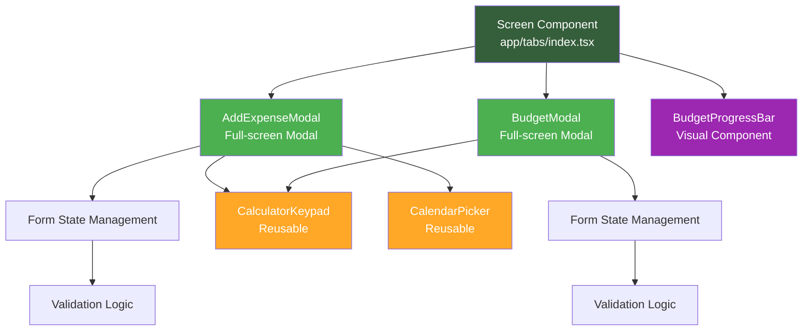
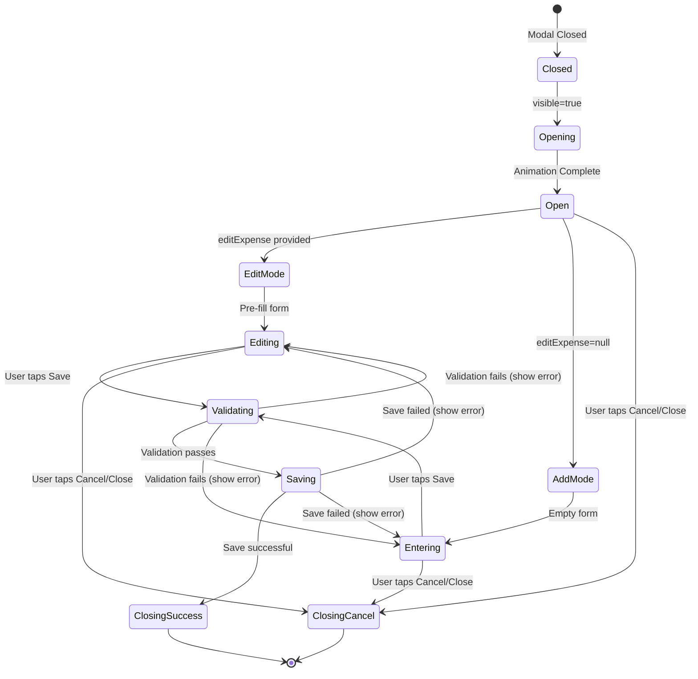
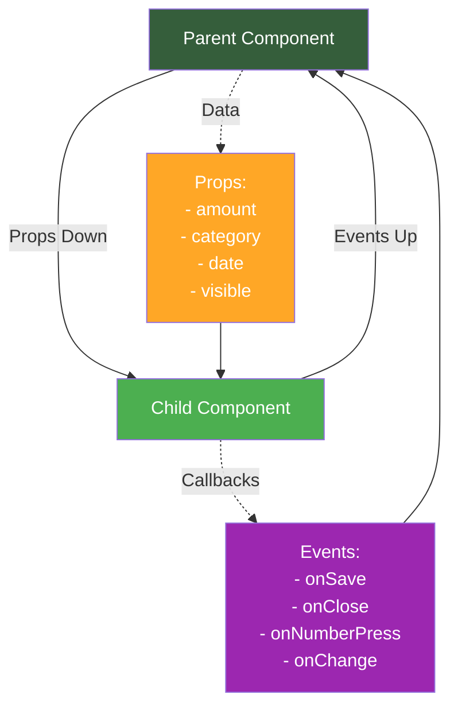
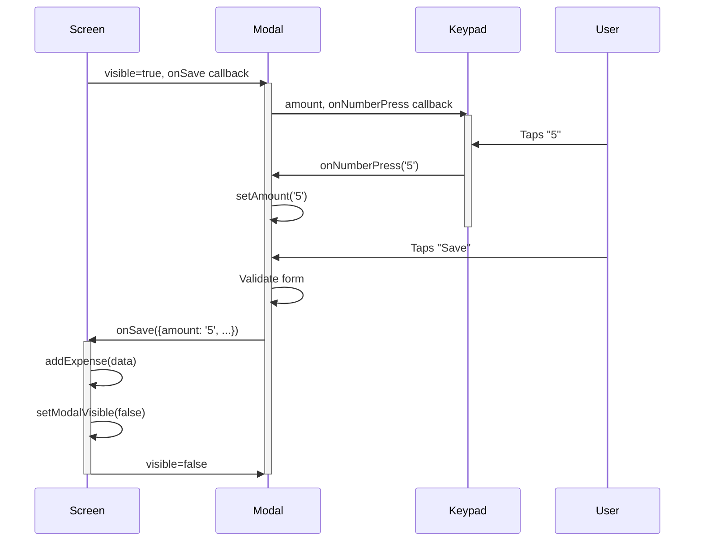

# Component Development Guide

This document provides comprehensive guidance for developing React components in BasicBudget, including modal patterns, form handling, reusable components, and styling conventions.

## Table of Contents

- [Component Architecture](#component-architecture)
- [Modal Components](#modal-components)
- [Form Components](#form-components)
- [Reusable Components](#reusable-components)
- [Visual Components](#visual-components)
- [Styling Patterns](#styling-patterns)
- [Props & Events](#props--events)
- [Component Communication](#component-communication)
- [Best Practices](#best-practices)

---

## Component Architecture

BasicBudget uses **functional components with hooks** following React best practices.



### Component Types

**1. Screen Components** (`/app`)
- Top-level route components
- Use hooks for data
- Render layout and child components
- Handle navigation

**2. Modal Components** (`/components/*Modal.tsx`)
- Full-screen overlays for forms
- Manage local form state
- Call parent callbacks on save/cancel
- Handle validation and errors

**3. Reusable Components** (`/components/*Keypad.tsx`, `*Picker.tsx`)
- Self-contained, reusable UI
- Accept props, emit events
- No business logic
- Stateless or minimal local state

**4. Visual Components** (`/components/*Bar.tsx`)
- Display-only components
- Transform data to visuals
- No user interaction (or minimal)
- Pure function of props

---

## Modal Components

Modal components provide full-screen overlays for complex forms like adding expenses or setting budgets.



### Modal Pattern

From `/components/AddExpenseModal.tsx`:

```typescript
interface AddExpenseModalProps {
  visible: boolean;                    // Controls modal display
  onClose: () => void;                 // Called when modal closes
  editExpense?: Expense | null;        // If editing, pre-fill data
  onSave: (expense: {...}) => void | Promise<void>; // Save callback
}

export default function AddExpenseModal({
  visible,
  onClose,
  editExpense,
  onSave,
}: AddExpenseModalProps) {
  // Local form state
  const [amount, setAmount] = useState('0');
  const [selectedCategory, setSelectedCategory] = useState<Category | null>(null);
  const [date, setDate] = useState(new Date());
  const [note, setNote] = useState('');
  const [loading, setLoading] = useState(false);
  const [inputMode, setInputMode] = useState<'calculator' | 'calendar'>('calculator');

  // Pre-fill when editing
  useEffect(() => {
    if (editExpense) {
      setAmount(editExpense.amount);
      setSelectedCategory(editExpense.category);
      setDate(editExpense.date);
      setNote(editExpense.note);
    } else {
      // Reset when adding new
      setAmount('0');
      setSelectedCategory(null);
      setDate(new Date());
      setNote('');
    }
    setInputMode('calculator');
  }, [editExpense, visible]);

  // Validation and save
  const handleSave = async () => {
    if (!selectedCategory) {
      Alert.alert('Missing Category', 'Please select a category.');
      return;
    }

    const amountNum = parseFloat(amount);
    if (isNaN(amountNum) || amountNum <= 0) {
      Alert.alert('Invalid Amount', 'Please enter a valid amount.');
      return;
    }

    setLoading(true);
    try {
      await onSave({ amount, category: selectedCategory, date, note });
      // Reset form on success
      setAmount('0');
      setSelectedCategory(null);
      setNote('');
      setDate(new Date());
    } catch (err) {
      console.error('Save failed:', err);
    } finally {
      setLoading(false);
    }
  };

  return (
    <Modal visible={visible} animationType="slide" onRequestClose={onClose}>
      {/* Header with Close and Save buttons */}
      <View style={styles.header}>
        <TouchableOpacity onPress={onClose} disabled={loading}>
          <Ionicons name="close" size={28} color="#333" />
        </TouchableOpacity>
        <Text style={styles.headerTitle}>
          {editExpense ? 'Edit Expense' : 'Add Expense'}
        </Text>
        <TouchableOpacity onPress={handleSave} disabled={loading}>
          {loading ? (
            <ActivityIndicator size="small" color="#355e3b" />
          ) : (
            <Ionicons name="checkmark" size={28} color="#355e3b" />
          )}
        </TouchableOpacity>
      </View>

      {/* Category selection grid */}
      {/* Date picker and note input */}
      {/* Calculator or calendar (mode toggle) */}
    </Modal>
  );
}
```

### Modal Best Practices

**1. Control Visibility Externally:**
```typescript
// Parent component
const [modalVisible, setModalVisible] = useState(false);

<AddExpenseModal
  visible={modalVisible}
  onClose={() => setModalVisible(false)}
  onSave={handleSave}
/>
```

**2. Reset State on Open/Close:**
```typescript
useEffect(() => {
  if (visible) {
    // Reset form when opening
    setAmount('0');
    setSelectedCategory(null);
  }
}, [visible]);
```

**3. Handle Loading States:**
```typescript
const [loading, setLoading] = useState(false);

// Disable buttons while saving
<TouchableOpacity onPress={handleSave} disabled={loading}>
  {loading ? <ActivityIndicator /> : <SaveIcon />}
</TouchableOpacity>
```

**4. Validate Before Save:**
```typescript
if (!selectedCategory) {
  Alert.alert('Error', 'Please select a category');
  return;
}
```

---

## Form Components

Form handling in React Native requires careful state management and validation.

### Form State Pattern

```typescript
// Individual fields
const [amount, setAmount] = useState('0');
const [category, setCategory] = useState<Category | null>(null);
const [date, setDate] = useState(new Date());
const [note, setNote] = useState('');

// Form-level state
const [loading, setLoading] = useState(false);
const [errors, setErrors] = useState<{[key: string]: string}>({});
```

### Input Handling

**Text Input:**
```typescript
<TextInput
  style={styles.input}
  placeholder="Add a note (optional)"
  value={note}
  onChangeText={setNote}
  placeholderTextColor="#999"
/>
```

**Custom Input (Calculator):**
```typescript
<CalculatorKeypad
  amount={amount}
  onNumberPress={(num) => setAmount(prev => prev === '0' ? num : prev + num)}
  onDecimalPress={() => !amount.includes('.') && setAmount(prev => prev + '.')}
  onBackspace={() => setAmount(prev => prev.length === 1 ? '0' : prev.slice(0, -1))}
  onClear={() => setAmount('0')}
/>
```

### Validation Pattern

```typescript
function validateForm(): boolean {
  const newErrors: {[key: string]: string} = {};

  if (!category) {
    newErrors.category = 'Category is required';
  }

  const amountNum = parseFloat(amount);
  if (isNaN(amountNum) || amountNum <= 0) {
    newErrors.amount = 'Amount must be greater than 0';
  }

  setErrors(newErrors);
  return Object.keys(newErrors).length === 0;
}

const handleSave = async () => {
  if (!validateForm()) {
    // Show first error
    const firstError = Object.values(errors)[0];
    Alert.alert('Validation Error', firstError);
    return;
  }

  // Proceed with save
  await onSave({...formData});
};
```

---

## Reusable Components

Reusable components are self-contained, accept props, and emit events via callbacks.

### Example: CalculatorKeypad

From `/components/CalculatorKeypad.tsx`:

```typescript
interface CalculatorKeypadProps {
  amount: string;
  onNumberPress: (num: string) => void;
  onDecimalPress: () => void;
  onBackspace: () => void;
  onClear: () => void;
}

export default function CalculatorKeypad({
  amount,
  onNumberPress,
  onDecimalPress,
  onBackspace,
  onClear,
}: CalculatorKeypadProps) {
  return (
    <>
      {/* Amount Display */}
      <View style={styles.amountDisplay}>
        <Text style={styles.currencySymbol}>$</Text>
        <Text style={styles.amountText}>{amount}</Text>
      </View>

      {/* Keypad Grid */}
      <View style={styles.keypad}>
        <View style={styles.keypadRow}>
          <CalculatorButton label="1" onPress={() => onNumberPress('1')} />
          <CalculatorButton label="2" onPress={() => onNumberPress('2')} />
          <CalculatorButton label="3" onPress={() => onNumberPress('3')} />
        </View>
        {/* ... more rows ... */}
        <View style={styles.keypadRow}>
          <CalculatorButton label="." onPress={onDecimalPress} />
          <CalculatorButton label="0" onPress={() => onNumberPress('0')} />
          <CalculatorButton
            label="⌫"
            onPress={onBackspace}
            onLongPress={onClear}
          />
        </View>
      </View>
    </>
  );
}
```

### Reusable Component Checklist

✅ **Clear Props Interface** - TypeScript interface defining all props
✅ **No Business Logic** - Only UI logic and presentation
✅ **Event Callbacks** - Emit events, don't manage parent state
✅ **Self-Contained Styles** - All styles defined in component
✅ **Documented Props** - Comments explaining each prop
✅ **Default Props** - Sensible defaults where applicable

---

## Visual Components

Visual components transform data into UI elements without user interaction.

### Example: BudgetProgressBar

From `/components/BudgetProgressBar.tsx`:

```typescript
interface BudgetProgressBarProps {
  totalExpenses: number;
  budgetAmount: number;
}

export default function BudgetProgressBar({
  totalExpenses,
  budgetAmount,
}: BudgetProgressBarProps) {
  // Calculate percentage
  const percentage = Math.min((totalExpenses / budgetAmount) * 100, 200);
  const isOverBudget = totalExpenses > budgetAmount;
  const overagePercentage = isOverBudget
    ? Math.min(((totalExpenses - budgetAmount) / budgetAmount) * 100, 100)
    : 0;

  const barColor = isOverBudget ? '#FF6B6B' : '#355e3b';

  return (
    <View style={styles.container}>
      <View style={styles.header}>
        <Text style={styles.label}>Budget</Text>
        <Text style={[styles.amount, isOverBudget && styles.amountOver]}>
          ${totalExpenses.toFixed(2)} of ${budgetAmount.toFixed(2)}
        </Text>
      </View>

      <View style={styles.progressBarBackground}>
        {/* Main bar (0-100%) */}
        <View
          style={[
            styles.progressBarFill,
            {
              width: `${Math.min(percentage, 100)}%`,
              backgroundColor: barColor,
            },
          ]}
        />

        {/* Extended bar (over 100%) */}
        {isOverBudget && (
          <View
            style={[
              styles.progressBarOverage,
              { width: `${overagePercentage}%`, backgroundColor: barColor },
            ]}
          />
        )}
      </View>

      {isOverBudget && (
        <Text style={styles.overBudgetText}>
          ${(totalExpenses - budgetAmount).toFixed(2)} over budget
        </Text>
      )}
    </View>
  );
}
```

---

## Styling Patterns

BasicBudget uses **StyleSheet.create** for optimized, consistent styling.

### StyleSheet Pattern

```typescript
const styles = StyleSheet.create({
  container: {
    flex: 1,
    backgroundColor: '#f5f5f5',
  },
  header: {
    flexDirection: 'row',
    justifyContent: 'space-between',
    alignItems: 'center',
    paddingHorizontal: 20,
    paddingVertical: 16,
  },
  title: {
    fontSize: 24,
    fontWeight: 'bold',
    color: '#333',
  },
});
```

### Color Conventions

```typescript
// Primary theme color
const PRIMARY_COLOR = '#355e3b';

// Status colors
const SUCCESS_COLOR = '#4CAF50';
const ERROR_COLOR = '#FF6B6B';
const WARNING_COLOR = '#FFA726';

// Text colors
const TEXT_PRIMARY = '#333';
const TEXT_SECONDARY = '#666';
const TEXT_DISABLED = '#999';

// Background colors
const BG_PRIMARY = '#fff';
const BG_SECONDARY = '#f5f5f5';
const BG_DISABLED = '#e0e0e0';
```

### Responsive Sizing

```typescript
// Use percentage for responsive widths
categoryTile: {
  width: '25%',  // 4 columns
  aspectRatio: 1, // Square
},

// Use fixed sizes for consistent UI elements
button: {
  height: 44,    // iOS recommended touch target
  borderRadius: 12,
},
```

### Platform-Specific Styles

```typescript
import { Platform } from 'react-native';

const styles = StyleSheet.create({
  text: {
    fontSize: 16,
    // Android-specific: Remove extra font padding
    ...Platform.select({
      android: {
        includeFontPadding: false,
      },
    }),
  },
});
```

---

## Props & Events

Clear prop interfaces and event patterns ensure maintainability.



### Props Interface Pattern

```typescript
interface ComponentProps {
  // Required props (no ?)
  visible: boolean;
  title: string;
  amount: number;

  // Optional props (with ?)
  subtitle?: string;
  initialValue?: string;

  // Callback props
  onSave: (data: DataType) => void | Promise<void>;
  onClose: () => void;

  // Optional callbacks
  onChange?: (value: string) => void;
}
```

### Event Callback Pattern

**Simple Callback:**
```typescript
// In child component
<TouchableOpacity onPress={onClose}>
  <Text>Close</Text>
</TouchableOpacity>

// In parent component
<Modal
  visible={modalVisible}
  onClose={() => setModalVisible(false)}
/>
```

**Callback with Data:**
```typescript
// In child component
const handleSave = () => {
  onSave({
    amount,
    category,
    date,
  });
};

// In parent component
<Modal
  onSave={(data) => {
    console.log('Saved:', data);
    addExpense(data);
  }}
/>
```

**Async Callback:**
```typescript
// In child component
const handleSave = async () => {
  setLoading(true);
  try {
    await onSave(data);
    // Success
  } catch (err) {
    // Error handled by parent
  } finally {
    setLoading(false);
  }
};

// In parent component
<Modal
  onSave={async (data) => {
    await addExpense(data);
    setModalVisible(false);
  }}
/>
```

---

## Component Communication

Components communicate through props (down) and callbacks (up).



### State Lifting Pattern

When sibling components need to share state, lift it to common parent:

```typescript
// ❌ Bad: State in child, no way to share
function ChildA() {
  const [value, setValue] = useState('');
  // ...
}

// ✅ Good: State in parent, passed to children
function Parent() {
  const [value, setValue] = useState('');

  return (
    <>
      <ChildA value={value} onChange={setValue} />
      <ChildB value={value} />
    </>
  );
}
```

---

## Best Practices

### 1. TypeScript Always

```typescript
// ✅ Good: Typed props and state
interface Props {
  amount: number;
  onSave: (amount: number) => void;
}

const [value, setValue] = useState<number>(0);

// ❌ Bad: No types
const Component = ({ amount, onSave }) => {
  const [value, setValue] = useState(0);
};
```

### 2. Extract Reusable Components

```typescript
// ✅ Good: Reusable button component
function PrimaryButton({ title, onPress }) {
  return (
    <TouchableOpacity style={styles.button} onPress={onPress}>
      <Text style={styles.buttonText}>{title}</Text>
    </TouchableOpacity>
  );
}

// ❌ Bad: Duplicate button code everywhere
<TouchableOpacity style={styles.button} onPress={handleSave}>
  <Text style={styles.buttonText}>Save</Text>
</TouchableOpacity>
```

### 3. Keep Components Focused

```typescript
// ✅ Good: Single responsibility
function ExpenseListItem({ expense }) {
  return (
    <View style={styles.item}>
      <Text>{expense.category}</Text>
      <Text>${expense.amount}</Text>
    </View>
  );
}

// ❌ Bad: Too many responsibilities
function ExpenseScreen() {
  // Handles: list rendering, modal, form state, database, navigation
}
```

### 4. Use StyleSheet.create

```typescript
// ✅ Good: Optimized styles
const styles = StyleSheet.create({
  container: { flex: 1 },
});

// ❌ Bad: Inline styles (recreated on every render)
<View style={{ flex: 1 }} />
```

### 5. Memoize Expensive Computations

```typescript
// ✅ Good: Memoized calculation
const total = useMemo(() => {
  return expenses.reduce((sum, e) => sum + parseFloat(e.amount), 0);
}, [expenses]);

// ❌ Bad: Recalculated every render
const total = expenses.reduce((sum, e) => sum + parseFloat(e.amount), 0);
```

---

## Related Documentation

- **[Architecture Overview](./01-architecture-overview.mdx)** - How components fit in system
- **[Hooks Guide](./03-hooks-guide.mdx)** - Using hooks in components
- **[Getting Started](./05-getting-started.mdx)** - Tutorial: Create a component

---

## Further Reading

- [React Native Components](https://reactnative.dev/docs/components-and-apis)
- [React Patterns](https://reactpatterns.com/)
- [StyleSheet API](https://reactnative.dev/docs/stylesheet)
