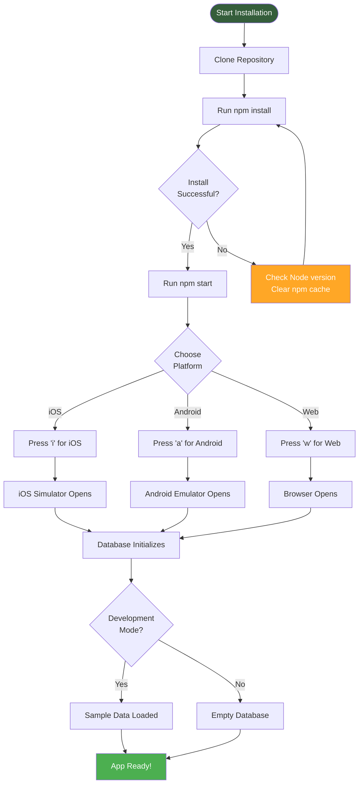
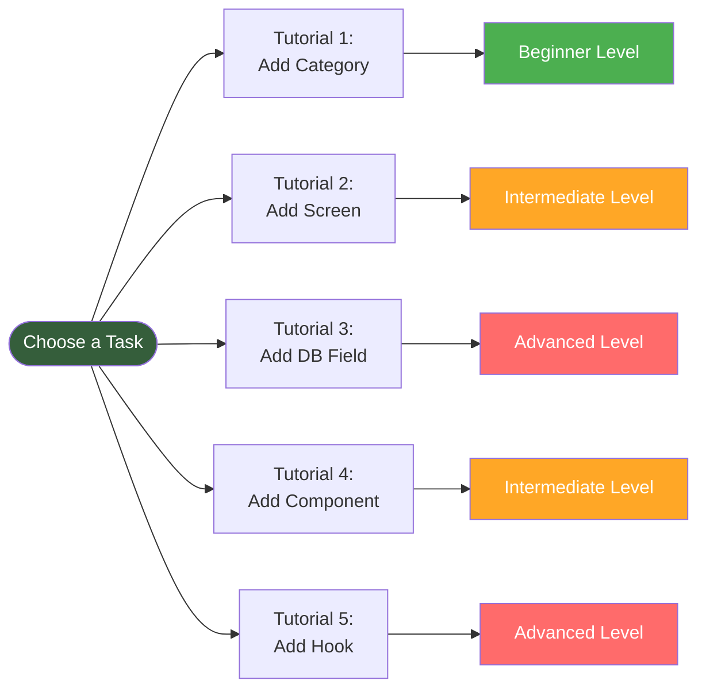
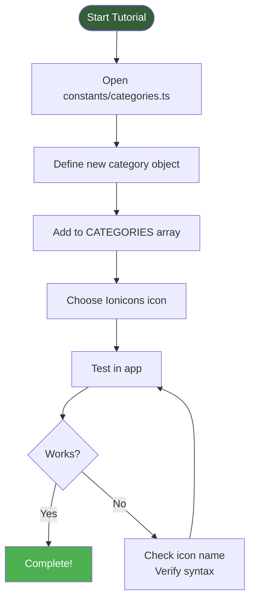

# Getting Started

Welcome to BasicBudget development! This guide will help you set up your environment, understand the project structure, and complete common development tasks through hands-on tutorials.

## Table of Contents

- [Prerequisites](#prerequisites)
- [Installation](#installation)
- [Project Tour](#project-tour)
- [Core Concepts](#core-concepts)
- [Common Tasks (Tutorials)](#common-tasks-tutorials)
- [Development Workflow](#development-workflow)
- [Troubleshooting](#troubleshooting)
- [Best Practices](#best-practices)
- [Resources](#resources)

---

## Prerequisites

Before you begin, ensure you have the following installed:

### Required

- **Node.js** (v18 or later) - [Download](https://nodejs.org/)
- **npm** (comes with Node.js) or **yarn**
- **Git** - [Download](https://git-scm.com/)

### Platform-Specific

**For iOS Development:**
- macOS only
- Xcode (latest version)
- iOS Simulator
- CocoaPods (`sudo gem install cocoapods`)

**For Android Development:**
- Android Studio
- Android SDK (API 31 or later)
- Android Emulator or physical device

**For Web Development:**
- Any modern browser (Chrome, Firefox, Safari)

### Recommended Tools

- **VS Code** with extensions:
  - ESLint
  - Prettier
  - React Native Tools
  - TypeScript

- **Expo Go app** on physical device:
  - [iOS](https://apps.apple.com/app/expo-go/id982107779)
  - [Android](https://play.google.com/store/apps/details?id=host.exp.exponent)

---

## Installation



### Step-by-Step Setup

**1. Clone the repository:**
```bash
git clone https://github.com/yourusername/BasicBudget.git
cd BasicBudget
```

**2. Install dependencies:**
```bash
npm install
```

**3. Start the development server:**
```bash
npm start
```

**4. Run on your platform:**

Press the corresponding key in the terminal:
- `i` - iOS Simulator (macOS only)
- `a` - Android Emulator
- `w` - Web Browser
- `r` - Reload app
- `m` - Toggle menu

**5. Verify installation:**
- App should open with sample data (in development mode)
- You should see the Budgets screen with expense categories
- Try adding an expense to verify database works

---

## Project Tour

### Folder Structure

```
BasicBudget/
├── app/                    # Expo Router screens
│   ├── _layout.tsx         # Root layout (Stack)
│   └── (tabs)/             # Tab navigator screens
│       ├── _layout.tsx     # Tab configuration
│       ├── index.tsx       # Budgets screen (main)
│       ├── charts.tsx      # Charts screen
│       └── more.tsx        # Settings screen
│
├── components/             # Reusable UI components
│   ├── AddExpenseModal.tsx # Add/edit expense form
│   ├── BudgetModal.tsx     # Set budget modal
│   ├── BudgetProgressBar.tsx # Progress visualization
│   ├── CalculatorKeypad.tsx  # Number input
│   └── CalendarPicker.tsx    # Date picker
│
├── hooks/                  # Custom React hooks
│   ├── useExpenses.ts      # Expense CRUD + state
│   └── useBudget.ts        # Budget management
│
├── lib/                    # Core utilities
│   ├── database.ts         # SQLite initialization
│   ├── expenses-db.ts      # Expense CRUD operations
│   ├── budgets-db.ts       # Budget CRUD operations
│   ├── first-launch.ts     # First-launch detection
│   └── seed-data.ts        # Sample data for dev
│
├── types/                  # TypeScript definitions
│   └── database.ts         # All type interfaces
│
├── constants/              # App-wide constants
│   ├── categories.ts       # Expense categories
│   └── sample-data.ts      # Sample expense data
│
├── assets/                 # Static assets
│   └── images/             # Image files
│
├── docs/                   # Documentation (you are here!)
│   ├── README.md
│   ├── 01-architecture-overview.mdx
│   ├── 02-database-guide.mdx
│   ├── 03-hooks-guide.mdx
│   ├── 04-component-development.mdx
│   └── 05-getting-started.mdx
│
├── app.json                # Expo configuration
├── eas.json                # Build profiles
├── package.json            # Dependencies
├── tsconfig.json           # TypeScript config
├── AGENTS.md               # Development guidelines
├── CLAUDE.md               # AI assistant instructions
└── README.md               # Project overview
```

### Key Files to Know

**Configuration:**
- `app.json` - Expo app configuration, name, version, icons
- `eas.json` - Build profiles (development, preview, production)
- `tsconfig.json` - TypeScript compiler options

**Entry Points:**
- `app/_layout.tsx` - Root layout, app-wide providers
- `app/(tabs)/index.tsx` - Main screen, most features here

**Core Logic:**
- `/lib/database.ts` - Database singleton, schema
- `/hooks/useExpenses.ts` - Primary data management hook
- `/types/database.ts` - All TypeScript interfaces

---

## Core Concepts

Before diving into development, understand these key concepts:

### 1. File-Based Routing (Expo Router)

Folder structure = routes:
```
/app/(tabs)/index.tsx  → /
/app/(tabs)/charts.tsx → /charts
/app/(tabs)/more.tsx   → /more
```

No need to manually configure routes!

### 2. Custom Hooks for State Management

Instead of Redux/MobX, we use custom hooks:
```typescript
const { expenses, addExpense, loading } = useExpenses();
```

Hooks encapsulate data + operations.

### 3. Optimistic Updates

UI updates immediately, database confirms in background:
```typescript
// User taps Save
addExpense(data); // UI updates instantly
// Database saves in background
// If error: rollback UI
```

### 4. Three-Tier Type System

```typescript
ExpenseRow (database) → Expense (application) ← ExpenseInput (user input)
```

Clear boundaries between layers.

### 5. SQLite for Local Persistence

All data stored locally on device:
- Fast (no network)
- Private (never leaves device)
- Persistent (survives app restarts)

---

## Common Tasks (Tutorials)



---

### Tutorial 1: Add a New Expense Category

**Difficulty:** Beginner | **Time:** 5 minutes

**Goal:** Add "Transportation" category with a car icon



**Step 1:** Open `/constants/categories.ts`

**Step 2:** Add new category to CATEGORIES array:

```typescript
export const CATEGORIES: Category[] = [
  // ... existing categories ...

  {
    id: 'transportation',
    name: 'Transportation',
    icon: 'car',          // Ionicons icon name
    color: '#9C27B0',     // Purple hex color
  },
];
```

**Step 3:** Save and reload app (press `r` in terminal)

**Step 4:** Verify:
- Open Add Expense modal (tap + button)
- New "Transportation" category should appear in grid
- Icon should be a car, color should be purple
- Selecting it should work like other categories

**Common Issues:**
- **Icon not showing:** Check [Ionicons directory](https://ionic.io/ionicons) for correct name
- **Category not appearing:** Check comma syntax, ensure array is properly formatted
- **App crashes:** Check TypeScript errors in terminal

**Next Steps:**
- Try different icons: `bus`, `bicycle`, `train`, `airplane`
- Experiment with colors: use hex codes like `#FF5722`

---

### Tutorial 2: Add a New Screen

**Difficulty:** Intermediate | **Time:** 15 minutes

**Goal:** Add "Reports" tab with basic UI

**Step 1:** Create new file `/app/(tabs)/reports.tsx`

```typescript
import { StyleSheet, Text, View } from 'react-native';

export default function ReportsScreen() {
  return (
    <View style={styles.container}>
      <Text style={styles.title}>Reports</Text>
      <Text style={styles.subtitle}>Coming soon...</Text>
    </View>
  );
}

const styles = StyleSheet.create({
  container: {
    flex: 1,
    justifyContent: 'center',
    alignItems: 'center',
    backgroundColor: '#f5f5f5',
  },
  title: {
    fontSize: 24,
    fontWeight: 'bold',
    marginBottom: 8,
  },
  subtitle: {
    fontSize: 16,
    color: '#666',
  },
});
```

**Step 2:** Update `/app/(tabs)/_layout.tsx`

Add new tab after "charts" screen:

```typescript
<Tabs.Screen
  name="reports"
  options={{
    title: 'Reports',
    tabBarIcon: ({ color, focused }) => (
      <Ionicons
        name={focused ? 'pie-chart' : 'pie-chart-outline'}
        size={28}
        color={color}
      />
    ),
  }}
/>
```

**Step 3:** Save and reload (press `r`)

**Step 4:** Verify:
- New "Reports" tab appears in bottom navigation
- Tapping it shows your new screen
- Icon changes when selected

**Next Steps:**
- Add real functionality (charts, statistics)
- Import and use useExpenses hook
- Calculate totals by category
- Create visualizations

---

### Tutorial 3: Add a Database Field

**Difficulty:** Advanced | **Time:** 30 minutes

**Goal:** Add "tags" field to expenses (string array)

**Step 1:** Update schema in `/lib/database.ts`

Add `tags` column to expenses table:

```sql
CREATE TABLE IF NOT EXISTS expenses (
  id TEXT PRIMARY KEY NOT NULL,
  amount TEXT NOT NULL,
  -- ... existing fields ...
  note TEXT,
  tags TEXT,                    -- NEW: JSON array of tags
  created_at INTEGER NOT NULL,
  updated_at INTEGER NOT NULL
);
```

**Step 2:** Update types in `/types/database.ts`

```typescript
// Application-level interface
export interface Expense {
  id: string;
  amount: string;
  category: Category;
  date: Date;
  note: string;
  tags: string[];         // NEW
}

// Database row interface
export interface ExpenseRow {
  id: string;
  amount: string;
  // ... existing fields ...
  note: string | null;
  tags: string | null;    // NEW: stored as JSON string
  created_at: number;
  updated_at: number;
}

// Input interface
export interface ExpenseInput {
  amount: string;
  category: Category | null;
  date: Date;
  note: string;
  tags: string[];         // NEW
}
```

**Step 3:** Update transformation in `/lib/expenses-db.ts`

```typescript
function rowToExpense(row: ExpenseRow): Expense {
  return {
    id: row.id,
    amount: row.amount,
    category: {
      id: row.category_id,
      name: row.category_name,
      icon: row.category_icon as any,
      color: row.category_color,
    },
    date: new Date(row.date),
    note: row.note || '',
    tags: row.tags ? JSON.parse(row.tags) : [], // NEW: parse JSON
  };
}
```

**Step 4:** Update INSERT/UPDATE in `/lib/expenses-db.ts`

```typescript
// In createExpense function
await db.runAsync(
  `INSERT INTO expenses (
    id, amount, category_id, category_name, category_icon, category_color,
    date, note, tags, created_at, updated_at
  ) VALUES (?, ?, ?, ?, ?, ?, ?, ?, ?, ?, ?)`,
  [
    id,
    expense.amount,
    expense.category.id,
    expense.category.name,
    expense.category.icon,
    expense.category.color,
    dateTimestamp,
    expense.note || null,
    JSON.stringify(expense.tags), // NEW: convert to JSON
    timestamp,
    timestamp,
  ]
);
```

**Step 5:** Update UI in `/components/AddExpenseModal.tsx`

Add tags input:

```typescript
const [tags, setTags] = useState<string[]>([]);
const [tagInput, setTagInput] = useState('');

// Add tag function
const addTag = () => {
  if (tagInput.trim()) {
    setTags([...tags, tagInput.trim()]);
    setTagInput('');
  }
};

// In render:
<View style={styles.tagsContainer}>
  <TextInput
    placeholder="Add tag"
    value={tagInput}
    onChangeText={setTagInput}
    onSubmitEditing={addTag}
  />
  <View style={styles.tagsList}>
    {tags.map((tag, idx) => (
      <View key={idx} style={styles.tag}>
        <Text>{tag}</Text>
        <TouchableOpacity onPress={() => setTags(tags.filter((_, i) => i !== idx))}>
          <Ionicons name="close" size={16} />
        </TouchableOpacity>
      </View>
    ))}
  </View>
</View>
```

**Step 6:** Delete old database and restart

```bash
# iOS Simulator
rm -rf ~/Library/Developer/CoreSimulator/Devices/*/data/Containers/Data/Application/*/Library/Caches/SQLite/budget.db

# Android Emulator
adb shell run-as host.exp.exponent rm -r /data/data/host.exp.exponent/databases/budget.db

# Or simply: Uninstall app and reinstall
```

**Step 7:** Test:
- Add expense with tags
- Edit expense, modify tags
- Verify tags save and load correctly

---

### Tutorial 4: Create a Reusable Component

**Difficulty:** Intermediate | **Time:** 20 minutes

**Goal:** Create DateRangePicker component

**Step 1:** Create `/components/DateRangePicker.tsx`

```typescript
import { View, Text, StyleSheet, TouchableOpacity } from 'react-native';
import { Ionicons } from '@expo/vector-icons';

interface DateRangePickerProps {
  startDate: Date;
  endDate: Date;
  onStartDateChange: (date: Date) => void;
  onEndDateChange: (date: Date) => void;
}

export default function DateRangePicker({
  startDate,
  endDate,
  onStartDateChange,
  onEndDateChange,
}: DateRangePickerProps) {
  const formatDate = (date: Date) => {
    return date.toLocaleDateString('en-US', {
      month: 'short',
      day: 'numeric',
      year: 'numeric',
    });
  };

  return (
    <View style={styles.container}>
      <TouchableOpacity
        style={styles.dateButton}
        onPress={() => {/* Open date picker for start */}}
      >
        <Ionicons name="calendar-outline" size={20} color="#666" />
        <Text style={styles.dateText}>{formatDate(startDate)}</Text>
      </TouchableOpacity>

      <Text style={styles.separator}>to</Text>

      <TouchableOpacity
        style={styles.dateButton}
        onPress={() => {/* Open date picker for end */}}
      >
        <Ionicons name="calendar-outline" size={20} color="#666" />
        <Text style={styles.dateText}>{formatDate(endDate)}</Text>
      </TouchableOpacity>
    </View>
  );
}

const styles = StyleSheet.create({
  container: {
    flexDirection: 'row',
    alignItems: 'center',
    justifyContent: 'space-between',
    paddingHorizontal: 20,
    paddingVertical: 12,
  },
  dateButton: {
    flexDirection: 'row',
    alignItems: 'center',
    backgroundColor: '#f5f5f5',
    paddingHorizontal: 16,
    paddingVertical: 10,
    borderRadius: 8,
  },
  dateText: {
    fontSize: 14,
    color: '#333',
    marginLeft: 8,
  },
  separator: {
    fontSize: 14,
    color: '#666',
    marginHorizontal: 8,
  },
});
```

**Step 2:** Use in a screen

```typescript
import DateRangePicker from '@/components/DateRangePicker';

function MyScreen() {
  const [startDate, setStartDate] = useState(new Date());
  const [endDate, setEndDate] = useState(new Date());

  return (
    <DateRangePicker
      startDate={startDate}
      endDate={endDate}
      onStartDateChange={setStartDate}
      onEndDateChange={setEndDate}
    />
  );
}
```

---

### Tutorial 5: Add a Custom Hook

**Difficulty:** Advanced | **Time:** 30 minutes

**Goal:** Create useCategories hook to manage custom user categories

**Step 1:** Create `/hooks/useCategories.ts`

```typescript
import { useState, useEffect } from 'react';
import * as SQLite from 'expo-sqlite';
import { Category } from '@/types/database';
import { getDatabase } from '@/lib/database';

export interface UseCategoriesReturn {
  categories: Category[];
  loading: boolean;
  error: Error | null;
  addCategory: (category: Omit<Category, 'id'>) => Promise<void>;
  refreshCategories: () => Promise<void>;
}

export function useCategories(): UseCategoriesReturn {
  const [categories, setCategories] = useState<Category[]>([]);
  const [loading, setLoading] = useState(true);
  const [error, setError] = useState<Error | null>(null);
  const [db, setDb] = useState<SQLite.SQLiteDatabase | null>(null);

  useEffect(() => {
    async function init() {
      try {
        const database = await getDatabase();
        setDb(database);
        await loadCategories(database);
      } catch (err) {
        setError(err as Error);
      } finally {
        setLoading(false);
      }
    }
    init();
  }, []);

  async function loadCategories(database: SQLite.SQLiteDatabase) {
    // Load from database or use default CATEGORIES
    // Implementation left as exercise
  }

  async function addCategory(category: Omit<Category, 'id'>): Promise<void> {
    if (!db) throw new Error('Database not initialized');

    try {
      // Generate ID, insert to database
      // Optimistic update: add to state immediately
      // Implementation left as exercise
    } catch (err) {
      await loadCategories(db);
      throw err;
    }
  }

  async function refreshCategories(): Promise<void> {
    if (!db) throw new Error('Database not initialized');

    setLoading(true);
    try {
      await loadCategories(db);
    } catch (err) {
      setError(err as Error);
    } finally {
      setLoading(false);
    }
  }

  return {
    categories,
    loading,
    error,
    addCategory,
    refreshCategories,
  };
}
```

**Step 2:** Use in component

```typescript
const { categories, addCategory, loading } = useCategories();

// Display categories
{categories.map(cat => (
  <CategoryItem key={cat.id} category={cat} />
))}

// Add new category
await addCategory({
  name: 'Custom Category',
  icon: 'star',
  color: '#FF6B6B',
});
```

---

## Development Workflow

### Daily Development

```bash
# Start development server
npm start

# Run on iOS (press 'i' in terminal)
# Run on Android (press 'a' in terminal)
# Run on Web (press 'w' in terminal)

# Reload app
# Press 'r' in terminal or shake device
```

### Making Changes

1. **Edit files** in your code editor
2. **Save** - changes auto-reload (Fast Refresh)
3. **Test** in simulator/device
4. **Commit** when feature complete

### Testing

```bash
# Run TypeScript type checking
npx tsc --noEmit

# Run linter
npm run lint
```

### Building

```bash
# Development build (internal testing)
eas build --profile development

# Preview build (TestFlight/Play Store internal)
eas build --profile preview

# Production build (release)
eas build --profile production
```

---

## Troubleshooting

### Common Issues

**Metro bundler errors:**
```bash
# Clear cache and restart
npm start --reset-cache
```

**Database errors:**
```bash
# Delete database and restart app
# iOS: Uninstall app from simulator
# Android: Clear app data
```

**TypeScript errors:**
```bash
# Check types
npx tsc --noEmit

# Common fix: Restart TS server in VS Code
# Cmd+Shift+P → "TypeScript: Restart TS Server"
```

**Build errors:**
```bash
# Clean install
rm -rf node_modules package-lock.json
npm install
```

---

## Best Practices

### Code Style

- **Use TypeScript** for everything
- **Follow ESLint rules** (auto-fix with `npm run lint --fix`)
- **Use meaningful names** (`createExpense` not `addE`)
- **Add comments** for complex logic only

### Component Guidelines

- **Keep components small** (<200 lines)
- **Extract reusable pieces** into separate components
- **Use StyleSheet.create** for styles
- **Type all props** with interfaces

### State Management

- **Use hooks** for data (`useExpenses`, `useBudget`)
- **Keep UI state local** (modal visibility, form inputs)
- **Don't prop drill** - use hooks directly where needed

### Database

- **Always validate** before INSERT/UPDATE
- **Handle errors** gracefully
- **Use transactions** for multiple operations
- **Test with real data** (not just happy path)

---

## Resources

### Internal Documentation

- **[Architecture Overview](./01-architecture-overview.mdx)** - System design and patterns
- **[Database Guide](./02-database-guide.mdx)** - SQLite schema and operations
- **[Hooks Guide](./03-hooks-guide.mdx)** - Custom hooks patterns
- **[Component Development](./04-component-development.mdx)** - React component patterns
- **[AGENTS.md](../AGENTS.md)** - Development guidelines and commands

### External Resources

**Expo & React Native:**
- [Expo Documentation](https://docs.expo.dev/)
- [React Native Documentation](https://reactnative.dev/)
- [Expo Router Guide](https://docs.expo.dev/router/introduction/)

**TypeScript:**
- [TypeScript Handbook](https://www.typescriptlang.org/docs/handbook/intro.html)
- [React TypeScript Cheatsheet](https://react-typescript-cheatsheet.netlify.app/)

**React Patterns:**
- [React Documentation](https://react.dev/)
- [React Hooks Reference](https://react.dev/reference/react)

**SQLite:**
- [SQLite Documentation](https://www.sqlite.org/docs.html)
- [expo-sqlite API](https://docs.expo.dev/versions/latest/sdk/sqlite/)

### Community

- **GitHub Issues** - Report bugs or request features
- **Expo Forums** - Get help with Expo-specific issues
- **Stack Overflow** - General React Native questions

---

**Congratulations!** You're now ready to contribute to BasicBudget. Start with Tutorial 1 and work your way up. Happy coding! 🚀
