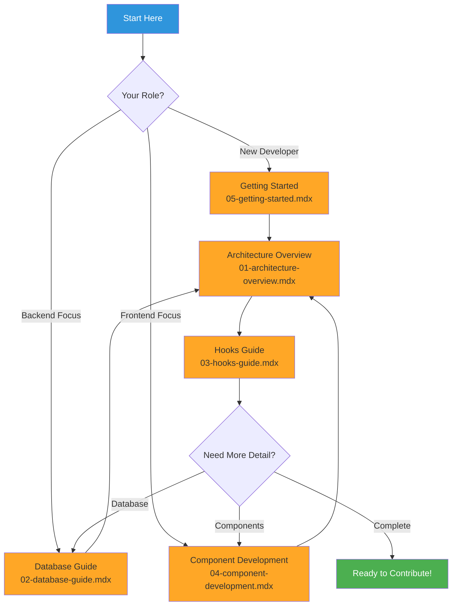

# BasicBudget Technical Documentation

Welcome to the BasicBudget technical documentation! This collection of documents provides in-depth information about the architecture, patterns, and development practices used in this React Native/Expo budget tracking application.

## Documentation Overview

This documentation is designed for:
- **AI Assistants** - Comprehensive context about codebase structure and patterns
- **New Developers** - Onboarding and understanding the project quickly
- **Experienced Developers** - Deep technical reference for architecture decisions
- **Contributors** - Guidelines for adding features and maintaining code quality

## Quick Navigation

### Core Documentation

1. **[Architecture Overview](./01-architecture-overview.mdx)**
   - System architecture and layered design
   - Data flow patterns and optimistic updates
   - Singleton database pattern
   - Type system design (Row/Application/Input)
   - Navigation structure with Expo Router
   - Key architectural decisions and rationale

2. **[Database Guide](./02-database-guide.mdx)**
   - Complete SQLite schema documentation
   - Expenses and Budgets tables
   - CRUD operation patterns
   - Query optimization and indexes
   - Database initialization and recovery
   - Type transformations (DB → Application layer)

3. **[Hooks Guide](./03-hooks-guide.mdx)**
   - Custom React hooks (useExpenses, useBudget)
   - Optimistic update patterns
   - State management strategies
   - Error handling and rollback mechanisms
   - Loading states and async operations
   - Hook composition in components

4. **[Component Development Guide](./04-component-development.mdx)**
   - React component patterns and structure
   - Modal components (AddExpenseModal, BudgetModal)
   - Reusable components (CalculatorKeypad, CalendarPicker)
   - Form handling and validation
   - StyleSheet patterns and theming
   - Component communication (props, callbacks, events)

5. **[Getting Started Guide](./05-getting-started.mdx)**
   - Installation and setup
   - Project tour and folder structure
   - Core concepts you need to know
   - Step-by-step tutorials for common tasks
   - Development workflow
   - Troubleshooting and best practices

## Documentation Map



## Learning Paths

### Path 1: New Developer (Recommended)
1. Start with **[Getting Started](./05-getting-started.mdx)** - Set up environment and understand project structure
2. Read **[Architecture Overview](./01-architecture-overview.mdx)** - Understand high-level design
3. Study **[Component Development](./04-component-development.mdx)** - Learn UI patterns
4. Deep dive into **[Hooks Guide](./03-hooks-guide.mdx)** - Master state management
5. Reference **[Database Guide](./02-database-guide.mdx)** - Understand data persistence

### Path 2: Backend/Database Focus
1. **[Database Guide](./02-database-guide.mdx)** - Master SQLite schema and operations
2. **[Architecture Overview](./01-architecture-overview.mdx)** - See how database fits in system
3. **[Hooks Guide](./03-hooks-guide.mdx)** - Understand data access layer
4. **[Component Development](./04-component-development.mdx)** - Learn how UI consumes data

### Path 3: Frontend/UI Focus
1. **[Component Development](./04-component-development.mdx)** - Master React component patterns
2. **[Hooks Guide](./03-hooks-guide.mdx)** - Understand state management
3. **[Architecture Overview](./01-architecture-overview.mdx)** - See the big picture
4. **[Database Guide](./02-database-guide.mdx)** - Understand data layer

### Path 4: AI Assistant Context
Read in order for complete context:
1. **[Architecture Overview](./01-architecture-overview.mdx)**
2. **[Database Guide](./02-database-guide.mdx)**
3. **[Hooks Guide](./03-hooks-guide.mdx)**
4. **[Component Development](./04-component-development.mdx)**

## Quick Reference

### Key Files by Function

**Database Layer:**
- `/lib/database.ts` - Database initialization and schema
- `/lib/expenses-db.ts` - Expense CRUD operations
- `/lib/budgets-db.ts` - Budget CRUD operations
- `/lib/first-launch.ts` - First-time app launch detection

**State Management:**
- `/hooks/useExpenses.ts` - Expense state and operations
- `/hooks/useBudget.ts` - Budget state and operations

**UI Components:**
- `/components/AddExpenseModal.tsx` - Add/edit expense form
- `/components/BudgetModal.tsx` - Set budget modal
- `/components/CalendarPicker.tsx` - Date picker
- `/components/CalculatorKeypad.tsx` - Number input
- `/components/BudgetProgressBar.tsx` - Visual progress indicator

**Type Definitions:**
- `/types/database.ts` - All TypeScript interfaces

**Screens:**
- `/app/(tabs)/index.tsx` - Home/Budgets screen
- `/app/(tabs)/charts.tsx` - Charts screen (placeholder)
- `/app/(tabs)/more.tsx` - Settings screen

**Configuration:**
- `/constants/categories.ts` - Expense categories
- `/app.json` - Expo configuration
- `/eas.json` - Build profiles

### Common Commands

```bash
# Development
npm start              # Start Expo development server
npm run ios            # Run on iOS simulator
npm run android        # Run on Android emulator
npm run web            # Run in web browser

# Building
eas build --profile development   # Development build
eas build --profile preview       # Preview build
eas build --profile production    # Production build

# Database
# SQLite database stored at: app data/budget.db
# Reset: Uninstall app and reinstall
```

### Common Tasks Quick Links

- **Add a new category** → [Getting Started: Tutorial 1](./05-getting-started.mdx#tutorial-1-add-a-new-category)
- **Create a new screen** → [Getting Started: Tutorial 2](./05-getting-started.mdx#tutorial-2-add-a-new-screen)
- **Add database field** → [Getting Started: Tutorial 3](./05-getting-started.mdx#tutorial-3-add-a-database-field)
- **Create reusable component** → [Getting Started: Tutorial 4](./05-getting-started.mdx#tutorial-4-create-a-reusable-component)
- **Add custom hook** → [Getting Started: Tutorial 5](./05-getting-started.mdx#tutorial-5-add-a-custom-hook)

## Architecture at a Glance

```
┌─────────────────────────────────────────┐
│          UI Layer (Components)          │
│  AddExpenseModal, BudgetModal, etc.     │
└──────────────┬──────────────────────────┘
               │ Props & Callbacks
┌──────────────▼──────────────────────────┐
│     State Management Layer (Hooks)      │
│    useExpenses, useBudget               │
└──────────────┬──────────────────────────┘
               │ CRUD Operations
┌──────────────▼──────────────────────────┐
│      Database Layer (lib/*-db.ts)       │
│  createExpense, setBudgetForMonth       │
└──────────────┬──────────────────────────┘
               │ SQL Queries
┌──────────────▼──────────────────────────┐
│           SQLite Database               │
│    Expenses table, Budgets table        │
└─────────────────────────────────────────┘
```

## Documentation Standards

All documentation follows these conventions:

- **MDX Format** - Markdown with JSX support for extensibility
- **Mermaid Diagrams** - Visual representations of architecture and flows
- **Real Code Examples** - Actual code from the codebase with file paths
- **Cross-References** - Links between related documentation
- **Consistent Colors** - Blue (#2f95dc) for primary, Red (#FF6B6B) for errors, Green (#4CAF50) for success

## Related Documentation

- **[AGENTS.md](../AGENTS.md)** - Comprehensive development guidelines and project info
- **[CLAUDE.md](../CLAUDE.md)** - AI assistant instructions
- **[README.md](../README.md)** - Project overview and setup

## Contributing

When modifying the codebase, please:
1. Follow patterns documented in these guides
2. Update relevant documentation if you change architecture
3. Add code examples for new patterns
4. Maintain consistent style with existing code

## Feedback

Found an issue or have a suggestion for improving this documentation? Please open an issue or submit a pull request!

---

**Last Updated:** December 2025
**Version:** 1.0
**Maintainer:** BasicBudget Team
